# GPU Media Runtime — Architecture Evolution

> **Status (2026-06):** Phases 1–4 in §4 have **shipped** — real video decode,
> image + text layers, single-track audio, and MP4 export all exist now. Read §4
> Phases 2–4 as the *design record* of what was built, not a future plan. The
> still-load-bearing parts of this document are **§3 (invariants I1–I12)**,
> **§6 (ownership)**, and **§7 (extension seams)** — those are the contract every
> renderer/decode change must preserve. The next genuinely-future layer is the
> scheduler / media coordinator (see [`ROADMAP.md`](../../../../../ROADMAP.md)).

> **Scope**: runtime-wide. This document covers the full chain from `Project`
> through `PlaybackEngine`, `resolveTimeline`, `Renderer`, and outward into the
> audio, text, export, and threading layers.
>
> **Relation to other documents**:
> - _Renderer internals_: [`architecture.md`](./architecture.md) — diagrams + pipeline; do not duplicate, cross-reference.
> - _Engine design principles and data model_: [`ARCHITECTURE.md`](../../../../../ARCHITECTURE.md).
> - _Current state + next layer_: [`ROADMAP.md`](../../../../../ROADMAP.md); known gaps: [`CURRENT_LIMITATIONS.md`](../../../../../CURRENT_LIMITATIONS.md).
>
> **Reading order**: §3 (invariants, load-bearing) → §6 (ownership) → §7 (seams).
> §1–§2 are current-state context; §4 is the shipped-phase design record.

---

## Table of Contents

1. [Current State Overview](#1-current-state-overview)
2. [System Execution Flow](#2-system-execution-flow)
3. [Stable Architectural Invariants](#3-stable-architectural-invariants)
4. [Next Evolution Phases](#4-next-evolution-phases)
5. [Threading Model](#5-threading-model)
6. [Ownership Model](#6-ownership-model)
7. [Extension Seams](#7-extension-seams)
8. [Anti-Patterns — Things to Never Do](#8-anti-patterns--things-to-never-do)
9. [Implementation Strategy](#9-implementation-strategy)
10. [Final Architectural Assessment](#10-final-architectural-assessment)

---

## 1. Current State Overview

### 1.1 What exists today

The runtime is organized as a strict dependency-direction stack:

```
Project / Tracks / Clips
      │
      ▼
resolveTimeline(frame, project) ──── pure function, no side effects
      │
      ▼
      Scene  ← immutable, referentially comparable
      │
      ▼
Renderer.render(scene) ──── synchronous, idempotent on equal refs
      │
      ▼
  Canvas pixels
```

The GPU renderer (`GpuRenderer`) is fully operational end-to-end for video
clips, including a tested decoder state machine, context-loss recovery, an LRU
texture pool, a frame-ownership rule enforced in every code path, and a full
Vitest suite covering the critical invariants. See [`architecture.md`](./architecture.md)
§ 12 and `gpu/__tests__/` for the complete test inventory.

The engine layer (`TimelineEngine`, `PlaybackEngine`) is also fully operational:
anchor-and-integrate clock, integer-frame time model, pure resolver, three-ring
state model. See [`video-editor/ARCHITECTURE.md`](../../../../../ARCHITECTURE.md) §§ 1–6.

Since this was first written, every layer it called absent has shipped: real
`VideoDecoder`-backed decode (`StreamingFrameProducer`), the audio subsystem
(`AudioPlaybackController`), text and image layers, and export (`core/export/`).
What remains absent is the **scheduler / media coordinator** that would make
decode predictive rather than reactive to the current playhead.

### 1.2 Stable primitives

The following are load-bearing primitives. Nothing in this document proposes
redesigning them; every evolution composes with them.

| Primitive | Role | Source of truth |
|---|---|---|
| `Project` | Authoring data model — tracks, clips, fps, stage | `ARCHITECTURE.md` § 4 |
| `TimelineEngine` | Single mutation funnel, undo/redo, event bus | `ARCHITECTURE.md` § 2 |
| `resolveTimeline(frame, project)` | Pure function: frame + project → Scene | `ARCHITECTURE.md` § 5 |
| `Scene` | Immutable, flat, serializable frame snapshot | `ARCHITECTURE.md` § 5 |
| `PlaybackEngine` | Anchor-and-integrate clock, RAF owner, transport | `ARCHITECTURE.md` § 3 |
| `Renderer` interface | `mount / resize / render / dispose` — four methods | [`types.ts`](./types.ts) |
| `GpuRenderer` | Current `Renderer` implementation | [`gpu/GpuRenderer.ts`](./gpu/GpuRenderer.ts) |
| `RenderGraph` | Layer orchestration: diff, acquire, release, zSort | `architecture.md` § 3 |
| `VideoLayer` | Provider + texture bookkeeping per clip | `architecture.md` § 7 |
| `TexturePool` | LRU GPU texture allocator (cap 16) | `architecture.md` § 3 |
| `FrameCache` | LRU decoded-frame cache, owns `VideoFrame` lifetime | `architecture.md` § 6 |
| `VideoFrameProvider` | Sync/async decode boundary abstraction | `architecture.md` § 6 |
| `VideoDecoderManager` | Full state machine: Idle → Ready → Decoding → Seeking | `architecture.md` § 8 |
| `WebGLContext` | GL context + context-loss/restore lifecycle | `architecture.md` § 9 |

### 1.3 Core invariants (summary)

These are stated in detail in [§3](#3-stable-architectural-invariants).
The short form:

- `render(scene)` is synchronous and never awaits.
- Renderer sees only `Scene` — never `Project`, engines, stores, or React.
- `Scene` is immutable; equal references are a no-op.
- Async decode is out-of-band; missed frames draw the last upload.
- Frame ownership: `FrameCache` owns, `VideoLayer` borrows, `VideoTexture.upload` closes in `finally`.
- Audio never touches `RenderGraph` or the render tick.
- Time is frames; seconds appear only at the media-element boundary.
- All mutations funnel through `TimelineEngine.commit()`.

### 1.4 Current strengths

- **Deterministic resolution.** `resolveTimeline` is a pure function: worker-safe, memoizable, renderer-agnostic. Every other architecture decision in this document rests on this property.
- **Frame-ownership rule is end-to-end.** Every code path that handles a `VideoFrame` follows a single, documented ownership contract (`architecture.md` § 10). There is no guessing.
- **Context-loss recovery is complete.** Every GPU-holding subsystem implements `handleContextLost`. The renderer survives driver resets and tab backgrounding silently. See `architecture.md` § 9.
- **Decoder state machine is tested.** `VideoDecoderManager` has `_assertTransition`, coalesced duplicate requests, and cancellation-on-seek already verified in isolation.
- **Debug pipeline is zero-cost in production.** `GpuRendererDebugPanel`, `DebugOverlay`, and `DebugGpuRenderer` are import-only-when-needed. See `architecture.md` § 11.
- **Layer abstraction is proven.** `VideoLayer` demonstrates the acquire/release/draw contract. `TextLayer` and future layers plug in without touching `GpuRenderer`.

### 1.5 Current risks

The risks this section originally listed — synthetic-only decode, no audio, no
export, main-thread blocking — have been retired by Phases 1–4. The standing
risks today:

| Risk | Consequence if unmitigated |
|---|---|
| No predictive scheduler | Backward scrubbing cold-starts from a keyframe; large seeks show a held/black frame until decode catches up |
| Decode runs on the main thread (off-tick) | Long GOPs / high resolutions compete with the UI for main-thread time |
| Audio export not yet hardened | Long or many-clip audio timelines (whole-file main-thread mix) are untested at scale |
| Single video/audio track tuning | Heavy multi-track compositing is not a validated path yet |

See [`CURRENT_LIMITATIONS.md`](../../../../../CURRENT_LIMITATIONS.md) for the full list.

---

## 2. System Execution Flow

### 2.1 Playback-to-pixels flow

The outer loop — from clock tick to canvas pixels. Called once per RAF frame.

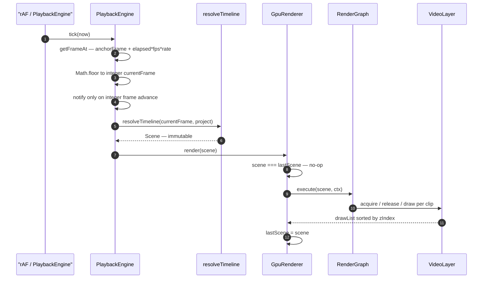

> Clock detail: `PlaybackEngine` is an anchor-and-integrate clock. See
> [`ARCHITECTURE.md` § 3](../../../../../ARCHITECTURE.md#3-time-frames-and-the-playback-clock)
> and [`playback/README.md`](../playback/README.md).

### 2.2 Render tick (synchronous path)

The synchronous path inside a single `render(scene)` call.
See [`architecture.md`](./architecture.md) § 5 for the full annotated sequence.

Summary:
1. Guard: `scene === lastScene` or context lost → return.
2. `WebGLContext.clear()`.
3. `RenderGraph.execute(scene, ctx)` — diff active vs scene items, acquire entering, release leaving.
4. Build `drawList` sorted ascending by `zIndex`.
5. Per entry: `VideoLayer.draw` → `VideoFrameProvider.getCurrent` → `VideoTexture.upload` → `gl.drawArrays`.
6. `lastScene = scene`.

**Nothing in this path awaits. Nothing in this path fires a timer.**

### 2.3 Async decode flow (out-of-band)

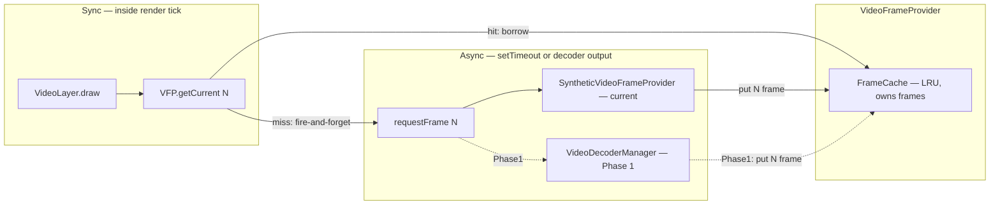

Cache miss behaviour: the renderer draws the **last uploaded texture content**
with no flicker. The async path catches up on the next tick when the decode
completes. See `architecture.md` § 6.

### 2.4 Frame lifecycle

Ownership is transferred, never shared. Exactly one `close()` per frame.

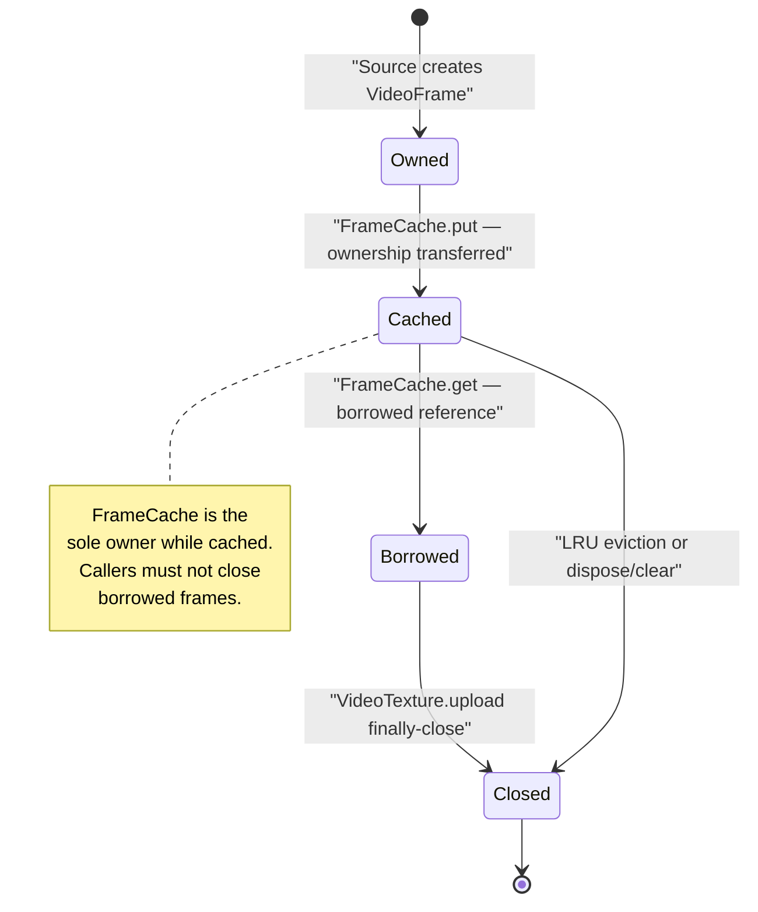

### 2.5 Texture lifecycle

GPU memory is pooled; handles are never held outside the pool contract.

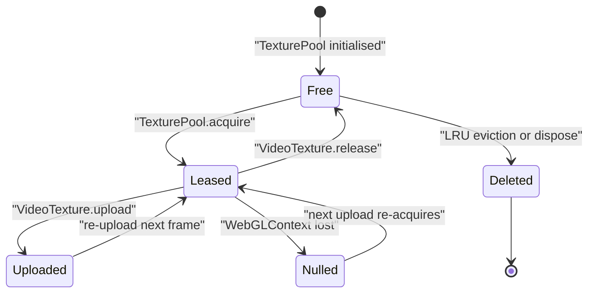

### 2.6 Synchronization flow (current + Phase 2)

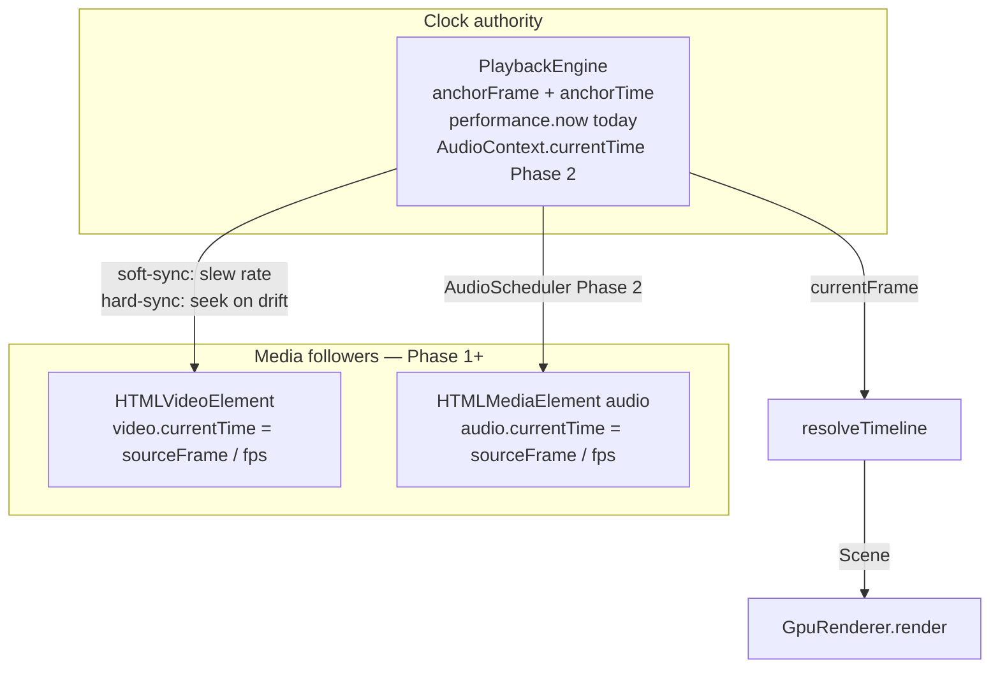

> Soft-sync vs hard-sync thresholds are not implemented today (the clock has no
> media-follower sync layer yet). When added, media elements are always
> followers; the clock is always the authority.

### 2.7 Export flow (Phase 4 — future)

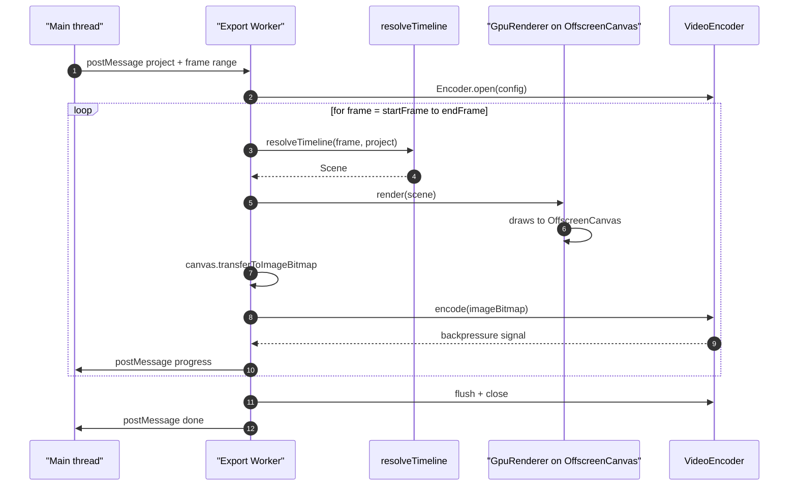

The export renderer is frame-stepped and deterministic: identical `(project, frame)` pairs produce identical pixels. No real-time clock, no RAF, no audio scheduling.

---

## 3. Stable Architectural Invariants

This section is the load-bearing contract for the runtime. Every subsystem,
PR, and future contributor must preserve these invariants. If a proposed change
violates one, stop and redesign.

---

### I1 — `render(scene)` is synchronous and never awaits

**Rule**: `Renderer.render(scene)` returns before the next line executes. It never calls `await`, never creates a `Promise`, never schedules a microtask from inside the call.

**Rationale**: The render call lives inside the RAF callback. An `await` would yield control back to the browser mid-frame, producing torn output and making frame timing non-deterministic.

**What breaks if violated**: Frame delivery becomes non-deterministic. The export renderer's frame-stepping model collapses. The no-flicker guarantee (draw last upload on miss) becomes impossible to enforce.

---

### I2 — Renderer reads only `Scene`

**Rule**: No file under `core/renderer/` imports `Project`, `Track`, `Clip`, `TimelineEngine`, `PlaybackEngine`, `useTracksStore`, `usePlaybackStore`, or any React symbol.

**Rationale**: The renderer is a sink, not a participant in state management. Coupling it to the engine or stores would prevent swapping renderers, running the renderer in a worker, or testing the renderer without a full editor.

**What breaks if violated**: Renderer-as-sink guarantee is lost. Export worker cannot use the renderer (DOM/store imports would crash). Renderer swap (DOM → GPU → headless) requires rewrites.

---

### I3 — `Scene` is immutable; equal references are a no-op

**Rule**: Once `resolveTimeline` returns a `Scene`, nothing mutates it. `GpuRenderer` guards `render(scene)` with `scene === lastScene` before doing any work.

**Rationale**: Reference equality is the cheapest possible diff. Producing a new `Scene` reference is the signal that something changed. If callers mutate the scene in place, this signal is lost.

**What breaks if violated**: Every RAF tick re-renders even when nothing changed. Memoization in `useResolvedScene` breaks. Export renderer frame-by-frame correctness is undermined.

---

### I4 — Async decode is out-of-band; missed frames draw last upload

**Rule**: `VideoFrameProvider.getCurrent(N)` is synchronous and non-blocking. A cache miss returns `null`; `VideoLayer.draw` keeps the last uploaded texture and fires `requestFrame(N)` as a fire-and-forget side effect.

**Rationale**: The render tick must complete within one RAF budget (~16 ms at 60 Hz). Waiting for a decode inside the tick would stall the browser.

**What breaks if violated**: Frame delivery latency becomes unbounded inside the render tick. Missed frames stall the entire rendering pipeline. The no-flicker guarantee is broken.

---

### I5 — `RenderGraph` is the sole orchestrator of layer lifecycle

**Rule**: Only `RenderGraph` calls `layer.acquire()` and `layer.release()`. Nothing else creates, destroys, or re-orders layer resources.

**Rationale**: `RenderGraph` owns the diff between consecutive `Scene` snapshots. Split acquisition responsibilities and you get double-acquire (resource leak) or premature release (use-after-free on GPU).

**What breaks if violated**: Texture leaks, dangling `VideoTexture` handles, use-after-free during context loss, double-close of `VideoFrame` objects.

---

### I6 — Audio never enters `RenderGraph` or the render tick

**Rule**: Audio clips in `Scene.audios` are consumed exclusively by the future `AudioScheduler`. No audio element, `AudioNode`, or `AudioContext` is touched inside `render()`, `RenderGraph.execute()`, or any `Layer` method.

**Rationale**: Audio scheduling is time-domain work driven by the clock authority, not by GPU frame delivery. Mixing them couples audio latency to GPU throughput.

**What breaks if violated**: Audio stutters whenever a frame drops. GPU context loss silences audio. Export renderer (no audio) becomes entangled with audio state.

---

### I7 — Export rendering is frame-stepped, deterministic, and reproducible

**Rule**: For any fixed `(Project, frame)` pair, `resolveTimeline → render → readPixels` produces pixel-identical output across runs, machines, and re-executions.

**Rationale**: Export is a batch computation, not a real-time playback. Users expect frame-accurate output. Non-determinism in export is a product-level regression.

**What breaks if violated**: Exported video differs between runs (non-reproducible bug, hard to file). Distributed rendering (N workers, frame ranges) cannot concatenate safely. Golden-frame CI tests become unreliable.

---

### I8 — Worker-safe subsystems import zero DOM / React / Zustand symbols

**Rule**: `resolveTimeline`, `GpuRenderer` (via `OffscreenCanvas`), and the future `VideoEncoder` wrapper may run in a Web Worker. These files must have zero transitive imports of `document`, `window`, React, or Zustand.

**Rationale**: Web Workers do not have access to the DOM. A single `document.createElement` call anywhere in the transitive import graph crashes the worker silently.

**What breaks if violated**: Export worker crashes at startup. Headless rendering is impossible. Worker-based resolver (future) cannot be instantiated.

---

### I9 — GL handles live behind the context-loss contract

**Rule**: Any subsystem that holds a GL handle (`WebGLTexture`, `WebGLProgram`, `WebGLVertexArrayObject`, etc.) must either (a) implement `handleContextLost()` that clears the handle without calling any GL function, and `onRestore()` / re-acquire path, or (b) hold no GL handles at all.

**Rationale**: Browser GPU contexts can be lost at any time (driver reset, tab backgrounded, alt-tab on some platforms). GL calls on a lost context are silently ignored or throw. Any subsystem that skips the protocol will leak handles or crash the restore path.

**What breaks if violated**: After context restore, invalid handle references cause silent rendering failures. Texture and program leaks accumulate across context-loss cycles.

> Current compliance map: `architecture.md` § 9.

---

### I10 — Frame ownership: cache owns, layer borrows, texture closes

**Rule**: A `VideoFrame` is owned by `FrameCache` from creation until it is passed to `VideoTexture.upload()`. Inside `upload()`, it is closed in a `finally` block — exactly once. Nothing else may call `frame.close()`.

**Rationale**: `VideoFrame` objects wrap GPU-decoded memory. Every frame closed zero times is a GPU memory leak. Every frame closed twice is undefined behaviour (usually a crash in the decoder pipeline).

**What breaks if violated**: GPU memory leaks accumulate during playback. Decoder pipeline crashes with double-close. Export worker exhausts GPU memory on long timelines.

> Ownership diagram: `architecture.md` § 10.

---

### I11 — Time is integer frames; seconds appear only at the media-element boundary

**Rule**: All internal time values are `number` (integer frames). The conversion `seconds = frame / fps` exists in exactly one place per media element type: where `HTMLVideoElement.currentTime` or `HTMLMediaElement.currentTime` is written.

**Rationale**: Floating-point seconds accumulate drift after splits, trims, and moves. Two clips that should be flush can be `0.0000003 s` apart and the renderer chooses arbitrarily which wins. Integer frames eliminate this entirely.

**What breaks if violated**: Clip seams flicker at high frame counts. Export audio/video goes out of sync on trimmed clips. `resolveTimeline` tests become order-dependent on floating-point rounding.

> See `ARCHITECTURE.md` § 3 "Why frames."

---

### I12 — All mutations funnel through `TimelineEngine.commit()`

**Rule**: Every write to `Project` state goes through `TimelineEngine.commit()`. No component, store, or effect writes project data directly.

**Rationale**: `commit()` is the boundary where history is recorded, events are emitted, and the immutable project reference is replaced. Side-channel writes produce silent history gaps, orphaned undo entries, and Ring 1 mirror desync.

**What breaks if violated**: Undo/redo skips changes. Ring 1 `useTracksStore` falls out of sync with Ring 0. Export captures a project snapshot mid-mutation.

> See `ARCHITECTURE.md` §§ 1 (P3), 2 (Ring 0).

---

## 4. Next Evolution Phases

Each phase is a coherent unit of work with a defined boundary, a subsystem map,
the invariants it must preserve, and explicit "what we are NOT doing" callouts.

Recommended execution order: **Phase 1 → Phase 5 (partial) → Phase 2 → Phase 3 → Phase 4 → Phase 5 (remainder)**. Phase 5 partial means the cleanup work that unblocks clean audio and text layer interfaces.

---

### Phase 1 — Video Pipeline Stabilization ✓ Done (2026-05-23)

**Goal**: Make the existing GPU renderer production-capable with real media.

**What this phase does NOT touch**: `resolveTimeline`, `Scene` shape, `RenderGraph` interface, `TexturePool` implementation, context-loss recovery, or the `Renderer` interface.

#### Subsystem map

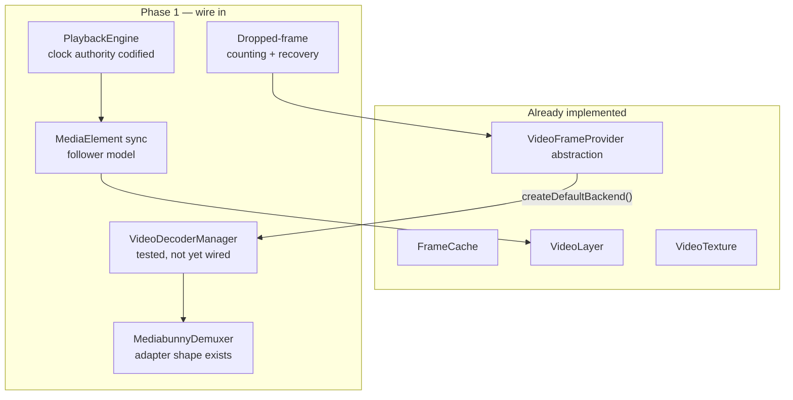

#### Scope

**Wire `VideoFrameProvider → VideoDecoderManager → MediabunnyDemuxer`**

The dotted edge in `architecture.md` § 3 becomes solid. `createVideoFrameProvider()` returns a `VideoDecoderManager`-backed provider in browsers instead of `SyntheticVideoFrameProvider`. The `MediabunnyDemuxer` adapter in `gpu/demuxer/` gets a real implementation.

**Playback clock authority**

`PlaybackEngine` today uses `performance.now()` as its time source. The anchor-and-integrate model (`ARCHITECTURE.md` § 3) already supports `AudioContext.currentTime` as a drop-in replacement. Phase 1 codifies the clock authority selection: `performance.now()` until Phase 2 wires `AudioContext`; no ad-hoc time sources anywhere else.

**Dropped-frame handling**

Provider records dropped frames in `GpuDebugCounters`. Renderer continues drawing the last uploaded texture (already the behaviour; Phase 1 makes it measurable). Skip-not-stall: if a decode is taking too long, the provider emits `null` rather than blocking.

**Rapid-seek stability**

`VideoDecoderManager`'s `Seeking` state already cancels pending decodes with `seek cancelled`. Phase 1 validates this under stress: 100 rapid seeks must produce zero leaked frames and zero `VideoDecoder` in a stuck state. See `architecture.md` § 8.

**Stress guardrails**

Bound `requestFrame` calls per provider: if N are already outstanding, additional calls are coalesced (already the `VideoDecoderManager` model for duplicate `requestFrame(N)` calls). Phase 1 extends this to cross-frame coalescing.

**Deterministic validation harness**

Golden-frame tests: for fixed `(project, frame)` pairs, hash `gl.readPixels` output and assert equality across runs. This validates I7 at the GPU level.

#### Invariants this phase must preserve

I1, I3, I4 (drop behaviour), I5, I9, I10 (extend to real `VideoDecoder.output` frames), I11.

#### Validation criteria

- M1: Real `MediabunnyDemuxer` decodes a 1080p mp4 to the canvas at ≥ 30 FPS with one clip.
- M2: Two clips on overlapping tracks; zIndex sort correct; no flicker on rapid seek.
- Stress: 100 rapid seeks; `GpuDebugCounters.droppedFrames` increments normally; no leaked frames (reported by `FrameCache.size` post-run), no stuck `VideoDecoderManager` instances.

---

### Phase 2 — Audio Subsystem  ✓ Shipped

> Shipped as `core/media/audio/AudioPlaybackController` (single track). The
> design below records the intended shape; the live implementation follows it.

**Goal**: Add deterministic, clock-following audio playback without coupling it to the GPU render pipeline.

**What this phase does NOT touch**: `RenderGraph`, any `Layer` class, `FrameCache`, `TexturePool`, `GpuRenderer`, or `Scene.videos`.

#### Subsystem map

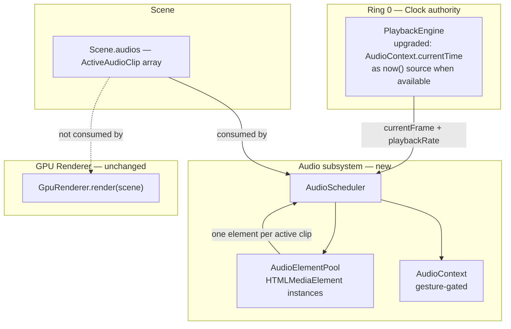

**Audio is not a layer.** `Scene.audios` is never passed to `RenderGraph`. `AudioScheduler` receives it directly and manages its own resource pool.

#### Scope

**`AudioScheduler` contract**

```
AudioScheduler.update(scene: Scene, clock: PlaybackEngine): void
```

Called on every RAF tick alongside `render(scene)`. Computes a diff between the previous `scene.audios` and the current, acquires/releases `HTMLMediaElement` instances from `AudioElementPool`, and applies sync corrections.

**`AudioElementPool`**

Mirrors the `VideoSourcePool` / `TexturePool` pattern. One pooled `HTMLMediaElement` per active audio clip, keyed by `clip.id`. On clip exit, the element is returned to the pool (paused, `src` cleared). Pool size bounded; overflow rejects new clips with a warning.

**Drift correction**

`AudioScheduler` reads `PlaybackEngine.getFrameAt()` (float-frame) for sub-frame accuracy. Applies hysteresis: soft-sync via `element.playbackRate` slew (±5–10%); hard-sync via `element.currentTime = sourceFrame / fps` when drift exceeds threshold. (Concrete drift thresholds are still TBD.)

**Clock upgrade**

When `AudioContext` is available (after gesture), `PlaybackEngine._now()` switches to `AudioContext.currentTime`. This eliminates audio-video drift by definition: the clock and the audio scheduler share the same hardware timebase. See `ARCHITECTURE.md` § 3 "Why not anchor to AudioContext."

**`HTMLMediaElement` → `WebAudio` migration path**

The `AudioScheduler` surface does not change. Phase 2 ships with `HTMLMediaElement` playback. A future phase replaces the internal pool with `AudioBufferSourceNode` feeding an `AudioContext` graph — same `update(scene, clock)` call, different internals.

#### Invariants this phase must preserve

I1 (audio never inside `render()`), I2, I3, I6 (defined here), I11.

**New invariant introduced**:

**I6 (enforcement)**: `AudioScheduler.update()` must complete before `render(scene)` is called in the same RAF tick, but must not be called from inside `render()`.

#### Validation criteria

- M3: Two audio clips play in sync; drift < 1 frame (33 ms at 30 fps) after 60 s of continuous playback.
- Context-loss: audio continues playing through a simulated GPU context loss (audio is never GL-coupled).
- Pool: 10 clips enter and exit over 10 s; `AudioElementPool.size` returns to pre-test value.

---

### Phase 3 — Text Layer  ✓ Shipped (Text + Image)

> Shipped as `gpu/layers/TextLayer` and `gpu/layers/ImageLayer`, sharing the quad
> pipeline. Placement math lives in `gpu/layers/textLayout.ts` (reused by the
> editor overlay and the export worker).

**Goal**: Demonstrate that the `Layer` abstraction generalizes. Text clips render with correct zIndex, transform, and opacity between video clips.

**What this phase does NOT touch**: `VideoLayer`, `VideoTexture`, `FrameCache`, `VideoDecoderManager`, or `Scene.videos`.

#### Subsystem map

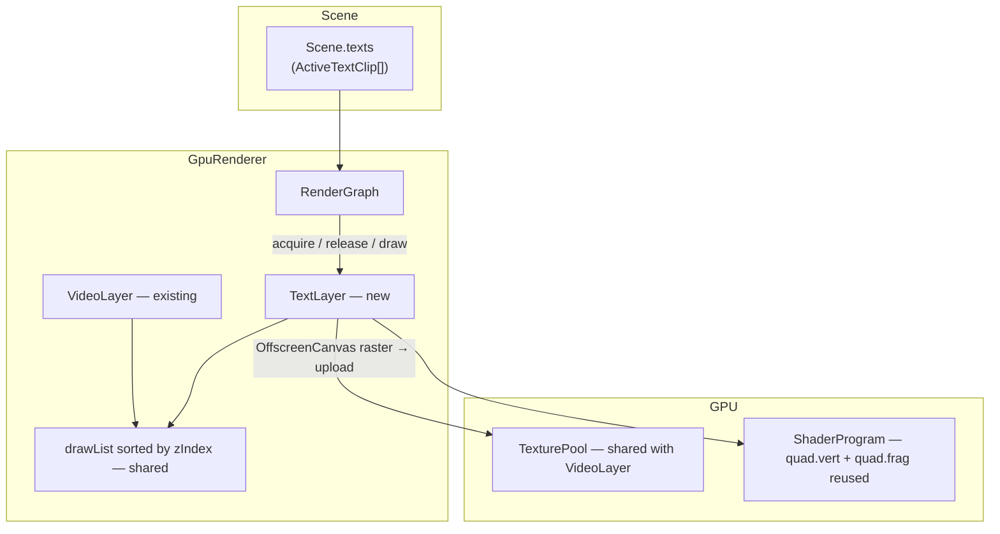

#### Scope

**`TextLayer` implements `Layer` contract**

```
acquire(item: ActiveTextClip, ctx: RenderContext): void
release(id: string): void
draw(item: ActiveTextClip, ctx: RenderContext): void
```

Same lifecycle as `VideoLayer`. `RenderGraph` is unchanged except for a second `registerLayer` call.

**Rasterization → upload path**

`TextLayer.draw` rasterizes the text content onto an `OffscreenCanvas`, wraps the result in a `VideoFrame`-compatible object (or uses `texImage2D` directly with `ImageBitmap`), and uploads via `TexturePool`. The same `VideoTexture`-style ownership rules apply: one upload, one close.

**zIndex sharing**

`RenderGraph.buildDrawList()` sorts all registered layers by `zIndex` together. A text clip with `zIndex = 1500` renders above a video clip with `zIndex = 1000` and below one with `zIndex = 2000`. No special-casing.

**Transform and opacity**

`ActiveTextClip` extends `ActiveClipBase`, which already carries `transform` and `opacity`. The same quad vertex shader (`gpu/shaders/quad.vert`) and uniform layout handle text quads identically to video quads.

**Future seams**

- Glyph atlas: replace per-clip `OffscreenCanvas` raster with sub-rect sampling of a shared `PoolTexture`. `TextLayer` interface does not change.
- Animated text: `resolveTimeline` re-resolves per frame; `Scene.texts[i].content` or `transform` changes → new `Scene` reference → `RenderGraph` detects update → `TextLayer` re-rasterizes. No special animation path needed.

#### Invariants this phase must preserve

I1, I3, I5 (RenderGraph owns TextLayer lifecycle), I9, I10 (extended: rasterized bitmaps follow the same close contract).

#### Validation criteria

- M4: Text clip renders with correct content, transform, and opacity between two video clips; zIndex ordering is correct.
- Rapid-seek: text content re-rasterizes correctly at each frame; no stale content.
- Layer isolation: removing `TextLayer` from `RenderGraph` compiles and runs without touching `VideoLayer`.

---

### Phase 4 — Export Renderer  ✓ Shipped (different shape)

> Shipped as `core/export/` — but as a **2D `OffscreenCanvas`** worker reusing the
> renderer's placement helpers + mediabunny mux, not a `GpuRenderer` on an
> OffscreenCanvas with a raw `VideoEncoder` as sketched below. The deterministic
> frame-stepping model held; the draw surface differs. See
> [`core/export/Architecture.md`](../export/Architecture.md).

**Goal**: Deterministic, worker-safe, frame-accurate export. Identical `(Project, frame)` tuples produce identical output.

**What this phase does NOT touch**: `resolveTimeline` signature, `Scene` shape, `RenderGraph`, or any live-playback code path.

#### Subsystem map

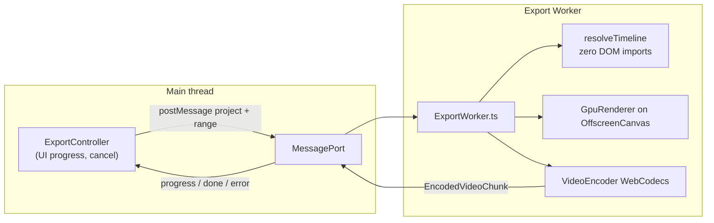

**Frame-stepping model: pull, not push.**

The export worker drives frame advance. The encoder's backpressure (`VideoEncoder.encodeQueueSize` vs `VideoEncoder.flush()`) gates the frame loop. The worker never runs ahead of the encoder by more than a configurable window.

#### Scope

**Worker execution**

`GpuRenderer` receives an `OffscreenCanvas` (transferred from main thread at worker startup). `resolveTimeline` is called with the current integer frame. No RAF, no `performance.now()`, no clock authority — frame stepping is explicit.

**Lifecycle**

```
ExportWorker.open(config)
  → VideoEncoder.configure(videoConfig)
  → for frame in [startFrame, endFrame]:
      scene = resolveTimeline(frame, project)
      renderer.render(scene)
      bitmap = canvas.transferToImageBitmap()
      encoder.encode(bitmap, { timestamp, keyFrame })
      if encodeQueueSize > WINDOW: await encoder.flush()
      postMessage({ progress })
  → encoder.flush()
  → encoder.close()
  → postMessage({ done })
```

**Cancellation**

Main thread posts `{ type: 'cancel' }`. Worker catches it between frames, calls `encoder.close()`, closes any in-flight `VideoFrame` objects, and terminates. No leaked GPU resources.

**Trim/split support**

Handled entirely by `resolveTimeline`. The export worker sees only `Scene.frame` and clips' `sourceFrame` values — no awareness of trim geometry.

**Progress reporting**

`postMessage({ type: 'progress', frame, totalFrames })` after each encoded frame. Main thread drives a progress bar.

**Distributed rendering seam**

N workers each own a contiguous frame range. Each produces an encoded chunk stream. Main thread (or a mux worker) concatenates. This is a pure extension: no changes to the single-worker contract.

#### Invariants this phase must preserve

I1, I2, I7 (enforced here), I8 (enforced here — worker cannot import DOM), I10, I11.

**New invariant enforced**:

**I7 (enforcement)**: Export CI test hashes `readPixels` output for 5 fixed `(project, frame)` tuples and asserts hash equality across 3 consecutive runs on the same machine.

#### Validation criteria

- M5: Export a 10 s, 1080p, 30 fps H.264 clip in a worker; output is hash-equal across two consecutive runs.
- Cancellation: cancel mid-export; no leaked `PoolTexture` entries, no orphaned worker.
- Trim: export a project with a 2 s trim on a 10 s clip; exported frames start at `sourceStartFrame`.

---

### Phase 5 — Cleanup and API Stabilization

**Goal**: No new features. Make the codebase match the architecture documents.

**What this phase does NOT touch**: any behaviour observable from `Renderer.render(scene)`.

#### Bottom-up (implementation details)

- **`WebGLContext`**: private-field naming convention (`_gl`, `_lost`, etc.) already good; audit for any `public` surface that should be `protected` or removed.
- **`TexturePool`**: document the LRU eviction policy (currently: evict lowest-index free entry) with a rationale comment. Add `TexturePool.stats()` returning `{ total, free, leased }` for the debug panel.
- **`ShaderProgram`**: consolidate the `uniform1f` / `uniform2fv` / `uniformMatrix3fv` helpers into a typed `setUniforms(bag)` method to reduce per-layer boilerplate.
- **`FrameCache`**: add JSDoc on `put` / `get` / `clear` stating the ownership contract explicitly. Currently implicit in `architecture.md`; make it explicit at the call site.

#### Top-down (public surface)

- **`GpuRenderer.setDebug`**: wire through to `apps/playground` and `GpuPreview`. Currently documented in `architecture.md` § 12 "Next" but not yet hooked.
- **`types.ts` freeze**: add `@public` JSDoc markers to every exported symbol that is part of the stable API. Anything without `@public` is considered internal and may change.
- **Naming consistency**: `acquire/release` is used by `RenderGraph` (for layer resources) and `TexturePool` (for texture slots); keep it. `claim/free` must not appear. Audit and rename any occurrences.
- **`dispose` audit**: every class that calls `gl.deleteXxx` must do so only in its `dispose(gl)` or equivalent — never in `handleContextLost`. Verify all classes.

#### Extension-seam documentation

Every `// future:` or `// TODO:` comment in `gpu/` becomes either:
1. A numbered entry in [§7 Extension Seams](#7-extension-seams) of this document, or
2. Deleted if the feature is now implemented.

#### Lifecycle docstring sweep

Every `dispose()` method gets a one-line JSDoc stating: what GL resources it deletes, what it does not delete (and why), and whether it is safe to call multiple times.

#### Invariants this phase must preserve

All of I1–I12 (this phase must not accidentally break any invariant — it is a refactor only).

#### Validation criteria

- `tsc --noEmit` clean.
- All Vitest suites green.
- `setDebug(true)` renders the debug overlay in the playground without errors.
- No `claim` or `free` method names in `gpu/**/*.ts`.

---

## 5. Threading Model

### 5.1 Execution domains

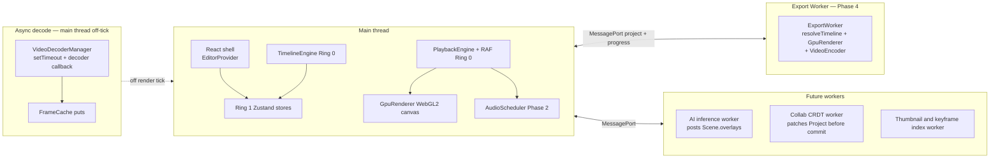

### 5.2 Responsibilities by domain

| Domain | Owns | Must not do |
|---|---|---|
| Main thread | RAF loop, React rendering, `TimelineEngine`, `PlaybackEngine`, current `GpuRenderer`, `AudioScheduler` | Block the thread with long synchronous work; create a second RAF authority |
| Async decode (main thread, off-tick) | `VideoDecoderManager` decode callbacks, `FrameCache.put` | Call any GL function; write to Zustand stores directly; call `render()` |
| Export worker | `resolveTimeline`, `GpuRenderer` (OffscreenCanvas), `VideoEncoder` | Import `document`, `window`, React, Zustand; run a RAF loop; touch `AudioContext` |
| Future AI / collab workers | Their own specialized work, post results via `MessagePort` | Import DOM, write `Project` without going through `TimelineEngine.commit` |

### 5.3 Render thread assumption

WebGL2 contexts are not transferable and are not thread-safe. There is exactly one `GpuRenderer` per canvas per thread. Multi-canvas scenarios (e.g. split-screen editor) use separate `GpuRenderer` instances, each with their own `WebGLContext` and `TexturePool`. They do not share GL objects.

### 5.4 Async scheduling rules

- Decode work: `VideoDecoderManager` uses `VideoDecoder.output` callbacks and `setTimeout` for frame generation. Never `requestAnimationFrame` inside a subsystem.
- Cache puts: `FrameCache.put` is synchronous; called from within `VideoDecoder.output` callbacks (off the render tick).
- Export frame loop: explicit `for` loop with `await encoder.flush()` for backpressure. No RAF.
- `AudioScheduler`: called synchronously from the RAF tick (before `render()`); does not `await`.

### 5.5 Multi-worker future

The export path already has a distributed seam (§4 Phase 4): N workers, N frame ranges, one mux. The AI inference worker pattern (posts computed overlay data into `Scene.overlays` for the next tick) is the canonical extension model for adding compute to the render pipeline without coupling it to the render tick.

---

## 6. Ownership Model

### 6.1 Resource lifecycle table

| Resource | Owner | Borrower(s) | Transfer point | Disposal trigger | Leak if violated |
|---|---|---|---|---|---|
| `VideoFrame` | `FrameCache` | `VideoLayer.draw` | `FrameCache.get()` → borrow; `VideoTexture.upload()` → close | `upload()` `finally` block; LRU eviction; `FrameCache.dispose()` | GPU decoded memory leak; decoder pipeline crash on double-close |
| `PoolTexture` (GL handle) | `TexturePool` | `VideoTexture` (leased) | `TexturePool.acquire()` → lease; `VideoTexture.release()` → return | LRU eviction → `gl.deleteTexture`; `TexturePool.dispose(gl)` | GPU VRAM leak; VRAM exhaustion at high clip counts |
| `VideoDecoder` | `VideoDecoderManager` | — | — | `VideoDecoderManager.dispose()` | Decoder handle leak; decode budget exhausted |
| `ProviderEntry` | `VideoLayer._providers` map | `VideoLayer._textures` (ref) | `VideoLayer.acquire()` bumps refCount; `VideoLayer.release()` decrements | refCount → 0 → `provider.markIdle()` | Provider kept alive after last clip leaves; source URL decoded unnecessarily |
| `VideoTexture` | `VideoLayer._textures` map | `RenderGraph` (indirect) | `RenderGraph` → `VideoLayer.acquire()` creates; `release()` destroys | `VideoLayer.release(id)` → `VideoTexture.dispose()` → returns `PoolTexture` | `PoolTexture` stranded in leased state; pool exhaustion |
| `WebGLProgram` + VAO | `VideoLayer` | — | — | `VideoLayer.dispose()` or context loss nulls and rebuilds | Shader program leak; phantom VAO reference after context restore |
| `AudioElementPool` slot | `AudioScheduler` | `AudioScheduler` (internal) | `AudioScheduler.update()` diff → acquire on enter, release on exit | Clip exits `Scene.audios`; `AudioScheduler.dispose()` | `HTMLMediaElement` keeps playing silently; memory leak if many clips |
| `VideoEncoder` (export) | Export worker | — | — | `encoder.flush()` + `encoder.close()` on completion or cancellation | Encoded chunks buffered indefinitely; worker memory grows without bound |
| `OffscreenCanvas` (export) | Export worker | `GpuRenderer` (ref) | Transferred to worker at startup | Worker termination | Canvas backing-store leak if worker is orphaned |
| `MessagePort` | Main thread | Export worker | `Worker.postMessage({ port }, [port])` | Worker `dispose()` → `port.close()` | Orphaned port keeps GC from collecting worker |

### 6.2 Context-loss ownership changes

During a context-loss event, GL handles become invalid. The rule:

- **Never call GL functions during `handleContextLost()`** — the context is gone; GL calls are undefined behaviour.
- **Clear handle references** (set to `null`) so subsequent code does not use stale handles.
- **Do not call `gl.deleteTexture` etc.** — the driver already reclaimed the memory.
- **On restore**: re-acquire from scratch. `TexturePool` re-allocates; `VideoLayer` rebuilds program + VAO; `VideoTexture` re-acquires a new `PoolTexture` on the next upload.

> Full recovery sequence: `architecture.md` § 9.

---

## 7. Extension Seams

These are the deliberate joints in the architecture where future systems plug in
without restructuring existing code. Each seam has a contract it must honour and
invariants it must preserve.

| # | Name | Where it plugs in | Contract to honour | Stays invariant |
|---|---|---|---|---|
| S1 | WebGPU migration | `WebGLContext` → `GraphicsContext` interface; `ShaderProgram` → `Pipeline` | `Layer.draw(item, ctx)` call site unchanged; `TexturePool` swap for `GPUBuffer`-backed pool | `RenderGraph`, all `Layer` classes, `Renderer` interface |
| S2 | Advanced effects / post-process | Between `RenderGraph.execute()` and final blit; or additional `ShaderProgram` per layer | Must not call `await`; must not touch `FrameCache` or decode state | I1, I5 |
| S3 | Transitions | `Scene.transitions` array (already reserved); `VideoLayer` receives `transition` metadata | `resolveTimeline` produces overlapping clips with transition; renderer composites blend pass | `Scene` shape extensible without breaking existing clips |
| S4 | AI overlays | `Scene.overlays` array (new); `OverlayLayer` registered in `RenderGraph` | AI worker posts bounding-box / segmentation data; layer renders textured quads | I2 (renderer sees only `Scene`), I5, I8 (AI worker is separate) |
| S5 | Collaborative runtime | `TimelineEngine.commit()` accepts CRDT / OT-merged `Project` patch | Mutations still go through `commit()`; Ring 0 remains authoritative | I12 |
| S6 | Sports replay / multi-camera | `Scene.videos` already supports multiple clips; slow-motion = `sourceFrame` interpolation in resolver | No renderer change; deterministic frame stepping covers instant replay | I3, I7 |
| S7 | Cloud / distributed rendering | Export worker's `(Scene, frame) → pixels` contract exposed as a remote RPC | Identical contract to local export; worker-safe invariants already hold | I7, I8 |
| S8 | Headless rendering | `GpuRenderer` receives `OffscreenCanvas` from `headless-gl` or WebGPU Node adapter | Renderer never imports `document` or `window` (already enforced by I2, I8) | I2, I8 |
| S9 | Public SDK / runtime API | Public surface: `{ TimelineEngine, resolveTimeline, Renderer, GpuRenderer }` | No React types in public exports; `Scene` and `Project` are plain TypeScript interfaces | All invariants I1–I12 |
| S10 | Worker decode migration | `VideoDecoderManager` moves behind a `MessagePort`; `DecoderBackedVideoFrameProvider` posts requests and receives `VideoFrame` objects | `getCurrent()` / `requestFrame()` interface unchanged; ownership rule I10 preserved because `VideoFrame.transfer()` is destructive — exactly one owner at all times | I1 (sync render), I10 (ownership) |
| S11 | Transferable `VideoFrame` | Decoded frames cross `postMessage` via `VideoFrame.transfer()` from a decode worker | Ownership transfers atomically; the receiving thread is sole owner; `FrameCache.put()` call site unchanged | I10 |
| S12 | Hardware acceleration paths | `VideoDecoderConfig.hardwareAcceleration` sourced from a project-level preference; forwarded through `RendererOptions` → `VideoDecoderManagerOptions` | No renderer or provider interface changes; decoder configuration is an internal detail of `VideoDecoderManager` | I2 (renderer sees only Scene) |
| S13 | Multi-stream decode scaling | Per-src `VideoDecoderManager` cap (max N active managers); LRU eviction of idle managers via the existing `markIdle` / idle-timeout path | Provider factory remains `(src, deps?) => VideoFrameProvider`; eviction is transparent to `VideoLayer` | I5 (RenderGraph owns layer lifecycle) |

---

## 8. Anti-Patterns — Things to Never Do

These are failure modes seen in production browser editors (Freecut, Remotion-derived
codebases, legacy Oxide-Editor attempts). Each one is named with the invariant it
violates and the real-world consequence.

---

**React state inside the renderer** _(violates I2)_

Calling `useState`, `useRef`, or `useEffect` inside renderer logic, or having the renderer re-render through the React component tree. The renderer is a sink; React is a consumer. When the renderer subscribes to the engine directly, it renders on clock ticks, not on React reconciliation cycles.

> Freecut lesson: the `composition-runtime` React-tree-as-runtime pattern couples audio sync latency to React re-render scheduling. See `09-freecut-architecture-lessons.md` § 2.2.

---

**Awaiting inside `render()`** _(violates I1)_

Any `await`, `Promise`, or `setTimeout` call inside `Renderer.render(scene)` or any method it calls synchronously. The common temptation: "just await the decode for this one frame." Result: torn frames, non-deterministic export, broken RAF budget.

---

**Renderer reading from `TimelineEngine` or Zustand** _(violates I2)_

Adding a convenience import: `import { useTracksStore } from '…'` inside a `Layer` or `GpuRenderer` to "just look up the clip name." Result: renderer becomes tightly coupled to state management; export worker crashes; renderer swap requires store plumbing.

---

**Monolithic `<Preview>` that owns playback, layout, and rendering** _(violates I2, I5)_

A single React component that holds a `useRef` to the renderer, subscribes to `usePlaybackStore`, manages the canvas size, drives the RAF loop, and imports `TimelineEngine`. This pattern is the single most common architectural collapse in browser editors. The fix: `<Preview>` hands a `container: HTMLElement` to `GpuRenderer`; `EditorProvider` owns the RAF subscription; the renderer drives itself.

> Freecut lesson: `MainComposition` is the canonical example of what happens when one component accumulates too many responsibilities. `09-freecut-architecture-lessons.md` § 8.

---

**Audio inside `RenderGraph` or any `Layer`** _(violates I6)_

Adding audio element playback inside `VideoLayer.draw()` or registering an `AudioLayer` in `RenderGraph`. Audio is time-domain; the render tick is frame-domain. Coupling them means audio stutters on dropped frames and GPU context loss silences audio.

---

**Mutating an already-emitted `Scene`** _(violates I3)_

Reaching into a `Scene` after `resolveTimeline` returns it and modifying a field "for convenience." Result: `GpuRenderer`'s `scene === lastScene` guard fires incorrectly; memoization in `useResolvedScene` returns stale data; export produces non-deterministic output.

---

**`requestFrame()` called synchronously inside `draw()` and awaited** _(violates I4)_

Changing `VideoFrameProvider.getCurrent` from a sync-non-blocking call to an async-blocking call. Result: `render()` stalls waiting for a decode; the entire RAF loop starves.

---

**GL handles held outside the context-loss contract** _(violates I9)_

Caching `gl.createTexture()` in a plain object field without implementing `handleContextLost()`. After context loss and restore, the handle is stale; GL calls with it produce silent garbage or crashes. Every GL-holding object must implement the contract.

---

**Closing a borrowed `VideoFrame` outside `VideoTexture.upload`** _(violates I10)_

Any code that receives a `VideoFrame` via `FrameCache.get()` and calls `frame.close()` on it before or after handing it to `upload()`. Result: double-close crash in the decoder, or the texture is uploaded from a closed frame (undefined pixel data).

---

**Engine state in `useState` / `useRef`** _(violates I12)_

Creating a `TimelineEngine` instance inside a React component with `useRef(new TimelineEngine())`. The engine is Ring 0; it must be constructed at `EditorProvider` scope, not inside a component. Component-scoped engines produce separate history stacks, no event propagation, and are silently re-created on hot reload.

---

**Two time authorities** _(violates I11, and corrupts clock integrity)_

Any subsystem that tracks time with its own RAF loop, `setInterval`, or `performance.now()` anchor independently of `PlaybackEngine`. The result is clock drift between the subsystem and the renderer — visible as audio/video desync that worsens over time.

> Freecut lesson: the `ClockBridge` exists because Remotion's original clock and Freecut's new clock coexisted during migration. You have no Remotion. Do not create two clocks. `09-freecut-architecture-lessons.md` § 9.

---

**Singletons for renderer or pool resources** _(general, from Freecut lesson § 9)_

`TexturePool.getInstance()`, `AudioScheduler.shared`, or any global singleton for resources that belong to a specific editor instance. Multiple editors on the same page share the singleton and corrupt each other's state. Everything is per-editor-instance, passed via constructor or context.

---

**Mixing exporter + effects GL state in one class** _(violates I9, violates separation between S2 effects seam and Phase 4 export)_

An exporter class that also holds `WebGLFramebuffer`, `EffectContext`, and `VideoEncoder` state in the same object. Seen in twick's `BrowserWasmExporter`. The consequence: the effects pipeline's GL handles are invisible to the context-loss contract because they live inside an exporter that has no `handleContextLost()`. In the export path, where there is no live canvas and no context loss events, this is survivable — but the pattern bleeds back into the live renderer if copied there. Keep export rendering, effects rendering, and encoder lifecycle in separate, composable objects.

---

## 9. Implementation Strategy

### 9.1 Recommended order

```
Phase 1 (video pipeline)
  ↓
Phase 5 partial (cleanup that produces clean Layer interface + types.ts freeze)
  ↓
Phase 2 (audio — depends on clean AudioScheduler contract)
  ↓
Phase 3 (text layer — depends on stable Layer contract from Phase 5 partial)
  ↓
Phase 4 (export — depends on worker-safe resolver + renderer from I8)
  ↓
Phase 5 remainder (docstrings, naming, seam documentation)
```

Phase 5 partial means: `types.ts` freeze, `acquire/release` naming audit, and `Layer` contract stabilization. These unblock Phase 2 and Phase 3 without doing the full cleanup sweep.

### 9.2 Validation milestones

| Milestone | Criterion | Phase |
|---|---|---|
| M1 | Real `MediabunnyDemuxer` decodes a 1080p mp4 to the canvas at ≥ 30 FPS | Phase 1 |
| M2 | Two clips on overlapping tracks; zIndex sort correct; no flicker on 100 rapid seeks | Phase 1 |
| M3 | Audio plays in sync; drift < 1 frame (33 ms at 30 fps) after 60 s of playback | Phase 2 |
| M4 | Text clip renders + transforms + zIndexes correctly between two video clips | Phase 3 |
| M5 | Export 10 s 1080p H.264 in a worker; hash-equal output across two runs | Phase 4 |

### 9.3 Testing priorities

**Vitest suites (currently 18)**

- One suite per new subsystem: `AudioScheduler.test.ts`, `TextLayer.test.ts`, `ExportWorker.test.ts`.
- Extend `VideoDecoderManager` tests for the now-wired demuxer path.
- Add `FrameOwnership.test.ts`: a stress test that asserts `FrameCache.size` returns to 0 after 100 seek cycles.

**Golden-frame tests**

For each milestone, capture `gl.readPixels` output for 3–5 fixed `(project, frame)` pairs and assert hash equality. Run in CI. These are the primary I7 enforcement mechanism.

**Stress harness**

```
for i in 1..100:
  GpuRenderer.render(scene_at_random_frame)
assert GpuDebugCounters.leakedFrames === 0
assert TexturePool.stats().leased === 0
assert VideoDecoderManager.all().every(d => d.state !== 'stuck')
```

**Context-loss integration test**

Simulate context loss via `WEBGL_lose_context.loseContext()`, then `restoreContext()`. Assert that the renderer produces the same output as before on the next `render(scene)` call (using the golden-frame hash for that scene).

### 9.4 Stabilization checkpoints

At the end of each phase:

1. `tsc --noEmit` clean with strict mode.
2. All Vitest suites green.
3. `GpuRenderer.setDebug(true)` debug overlay shows correct FPS, clip count, texture count, cache hit ratio, and render ms.
4. No `console.error` output during a 60 s playback session with two video clips and one text clip.

### 9.5 Release checkpoints

| Checkpoint | Criteria |
|---|---|
| MVP | Milestones M1–M4 met; audio + text + video render correctly; export not required |
| v1.0 | All milestones M1–M5 met; export is deterministic; stress harness passes; all invariants documented and linted |

---

## 10. Final Architectural Assessment

### 10.1 Maturity

The **renderer subsystem** (`gpu/`) is production-grade in shape: correct interface,
complete invariant set, full context-loss recovery, end-to-end frame ownership,
18 test suites. It is production-grade in function once Phase 1 ships the real
decoder backend.

The **engine layer** (`TimelineEngine`, `PlaybackEngine`, `resolveTimeline`) is
production-grade in design. The anchor-and-integrate clock, the pure resolver, and
the three-ring state model are correct architectural choices with no known design
flaws.

The **audio, text, and export layers** do not exist yet, but their architectural
homes are well-defined (§4 Phases 2–4). They will not require restructuring the
layers that precede them.

### 10.2 Scalability

- **Clip count**: linear in clips per frame in `resolveTimeline` (filter over flat clip arrays). `TexturePool` bounds GPU memory at 16 textures LRU regardless of clip count. Suitable for 10–20 simultaneous clips before pool pressure becomes visible.
- **Multi-camera / sports replay**: `Scene.videos` already supports N clips. The resolver handles multi-camera natively. Instant replay is a seek operation on a pure clock — no special path.
- **High resolution**: GPU upload bandwidth is the bottleneck above 4K. Mitigation: transferable `VideoFrame` objects decoded off the main thread and transferred to the render tick (Web Worker + `VideoDecoder` + `VideoFrame.transfer()`).
- **Export throughput**: frame-stepping in a worker removes the 16 ms RAF constraint. Export speed is bounded by `VideoEncoder` throughput and GPU upload bandwidth, not by the editor's playback framerate.
- **Long timelines**: `resolveTimeline` is O(tracks × clips-per-track) per call. For timelines with hundreds of clips, a sorted binary-search variant (`bisectStartFrame`) reduces this to O(tracks × log(clips)). This optimization is memoizable and does not require a design change.

### 10.3 Technical strengths

- **Pure resolver** — the single highest-leverage architectural decision. Makes the renderer swappable, the exporter deterministic, and the engine testable without a DOM.
- **Immutable `Scene`** — referential equality guards eliminate redundant GPU work. The scene is the diff.
- **Frame-ownership rule** — end-to-end, documented, enforced in `finally`. GPU memory lifecycle is auditable without a memory profiler.
- **`_assertTransition` in `VideoDecoderManager`** — explicit, tested state machine transitions. Decoder bugs surface as assertion failures, not as silent incorrect behaviour.
- **Context-loss recovery** — complete, tested. The renderer degrades gracefully on driver resets and recovers automatically. Most browser editors skip this entirely.
- **Layered abstraction** — `VideoLayer` is a proven template. `TextLayer`, `OverlayLayer`, and future layer types are additive; they do not modify existing code.
- **Three-ring state model** — clean separation between engine truth (Ring 0), React mirror (Ring 1), and UI transient state (Ring 2). Prevents the most common React-editor failure mode (engine state in `useState`).

### 10.4 Areas needing caution

- **Clock authority** — `PlaybackEngine` uses `performance.now()` today. `AudioContext.currentTime` upgrade must happen before audio ships (Phase 2) or drift will be visible from the first frame of audio. The architecture supports the upgrade; it is not yet wired.
- **Worker execution** — `GpuRenderer` has never run in a worker. `OffscreenCanvas` + WebGL2 is well-supported in modern browsers but requires testing. The first export CI run may surface import-graph violations (DOM symbol imports) not caught by `tsc`.
- **`HTMLVideoElement` backend** — `DomRenderer` (PR-10) is not yet built. The `VideoPool` pattern (keyed element reuse by clip id) is architecturally obvious but untested in this codebase. Freecut's `VideoSourcePool` is the production reference; see `07-video-element-pooling.md`.
- **Phase 5 debt** — naming inconsistency (`acquire/release` vs `claim/free`), missing lifecycle JSDoc, and unwired debug surface are small in isolation but compound if deferred past v1.0.

### 10.5 Likely future bottlenecks

| Bottleneck | When it appears | Architectural mitigation |
|---|---|---|
| GPU upload bandwidth | 4K video, 4+ simultaneous clips | Decode on a worker thread; transfer `VideoFrame` to main thread via `VideoFrame.transfer()` |
| Single WebGL2 context | GPU parallelism limits; advanced effects requiring multiple render targets | S1: WebGPU migration; multi-pass render targets within one context (intermediate FBO) |
| `FrameCache` size tuning | High clip count; many concurrent seek positions | Per-source quotas; eviction policy tunable via `FrameCache` constructor |
| JS GC pauses during export | Long exports allocating many `Uint8Array` for encoded chunks | Pre-allocate ring buffer in export worker; reuse chunk backing stores |
| `resolveTimeline` at high clip count | 500+ clips across 20 tracks | Binary-search by `startFrame`; memoize per `(frame, projectVersion)` pair |
| Main-thread audio scheduling jitter | High-latency `setTimeout` under CPU load | Migrate to `AudioContext`-scheduled sources (WebAudio); remove `setTimeout` from `AudioScheduler` critical path |

### 10.6 Strategic position

This architecture is a smaller, cleaner expression of the same ideas that
production editors — Freecut, Remotion, native NLE web ports — arrived at through
years of iteration. The Scene boundary, the single time authority, the imperative
renderer-as-sink, and the pure resolver are present in all of them. Here they were
designed in from the start rather than discovered under deadline.

The competitive advantage is the clean slate: no Remotion migration scars, no dual
event buses, no React-tree-as-runtime, no stub APIs. That cleanliness is fragile —
deadline pressure bends the rules listed in §8 first. The invariants in §3 are the
guardrails that keep it clean. Lint them.

The long-term bet: a renderer-agnostic, worker-safe, pure-function core is the
foundation for a licensable SDK, a cloud rendering service, a headless export API,
and eventually a distributed GPU runtime. None of those require a design change.
They require that §3 never be violated.

---

_Last updated: 2026-05-23. Cross-references validated against [`architecture.md`](./architecture.md) (renderer internals), [`video-editor/ARCHITECTURE.md`](../../../../../ARCHITECTURE.md) (engine), [`video-editor/ROADMAP.md`](../../../../../ROADMAP.md) (PR sequencing), and study docs `01–09` at the workspace root._

---

## 11. Change Log

### 2026-05-23 — Phase 1: Video Pipeline Stabilization

**Subsystems wired / added**:

- `DecoderBackedVideoFrameProvider` — real `VideoDecoderManager`-backed provider replacing `SyntheticVideoFrameProvider` as the production default. Receives a `DemuxerFactory` via `RendererOptions`; falls back to synthetic when not provided.
- `createVideoFrameProvider(src, deps?)` — factory extended to accept `VideoFrameProviderDeps` for demuxer/decoder injection.
- `VideoDecoderManager` — `fps` parameter added (previously hardcoded to 30). `onDecodeLatency` and `onDroppedFrame` hooks added.
- `GpuDebugCounters` — new counters: `droppedFrames`, `outstandingDecodes`, `decoderStateTransitions`. `incDropped()` and `recordDecoderTransition()` helpers added.
- `GpuRendererDebugPanel` / `DebugPanelSnapshot` — surfaces `droppedFrames` and `outstandingDecodes`.
- `RendererOptions` — extended with `demuxerFactory`, `decoderFactory`, `maxOutstandingDecodes`.
- `VideoLayer` — accepts `VideoFrameProviderDeps` as an alternative to a full `VideoFrameProviderFactory`.
- `createMediabunnyBackend` — optional adapter wrapping the mediabunny npm package into `DemuxerBackend`. Ships with `isMediabunnyCompatible()` guard and a comprehensive actionable error message.
- `MediabunnyDemuxer` — `createDefaultBackend()` replaced with a lazy import path that validates the module shape and delegates to `createMediabunnyBackend`.
- `RecordingGl` (test-only) — `WebGL2RenderingContext` stub that records draw calls into a byte log for SHA-256 golden-frame hashing.

**New test suites** (added to `gpu/__tests__/`):
- `DecoderBackedVideoFrameProvider.test.ts` — happy path, coalescing, cap, dispose.
- `RapidSeekStress.test.ts` — 100+ seek cycles, leak counters, non-stuck assertion.
- `FrameOwnership.test.ts` — FrameCache ownership invariant, multi-clip, double-close detection.
- `ProviderDisposal.test.ts` — lifecycle state machine, idle timer, error-state cleanup.
- `GoldenFrameHash.test.ts` — deterministic hash across 3 runs and context-loss cycle.
- Extended `VideoDecoderManager.test.ts` — fps parameterization, hook invocation, drain cancellation.
- Extended `MediabunnyDemuxer.test.ts` — actionable error when mediabunny absent.

**Invariants preserved**:
- I1: `render(scene)` remains synchronous. `DecoderBackedVideoFrameProvider.requestFrame()` is fire-and-forget. `getCurrent()` never awaits.
- I3: `scene === lastScene` guard untouched. Validated by `GoldenFrameHash` 3-run test.
- I4: cache miss returns `null`; last uploaded texture drawn; `requestFrame` is fire-and-forget.
- I5: `RenderGraph` is the sole orchestrator. `VideoLayer` accepts deps; no orchestration bypass.
- I9: GL handles live behind context-loss contract; `DecoderBackedVideoFrameProvider` holds no GL objects (immune to context loss).
- I10: `FrameCache` owns frames; `cache.put()` transfers ownership from decoder; `upload()` closes in `finally`.
- I11: Integer frame model preserved; `fps` parameter ensures correct microsecond timestamps.

**Architectural tradeoffs**:
- mediabunny is optional (peer, not a dep): keeps the package footprint small; consumers opt in. Tradeoff: consumers must wire the factory; the error message is comprehensive enough to guide them.
- `maxOutstanding` cap (default 4) is a conservative bound; high-throughput use cases may increase it. Frame drops are observable via `GpuDebugCounters.droppedFrames`.
- `RecordingGl` is a call-recording stub, not a pixel-rendering stub. Golden hashes encode draw order and uniform values, not pixel bytes. True pixel hashes require a real GPU (deferred to Phase 4 CI / Playwright).

**Future implications** (new seams documented, §7 S10–S13):
- S10: Worker decode migration — `DecoderBackedVideoFrameProvider` is the natural seam. The provider interface does not change; the manager moves behind a `MessagePort`.
- S11: Transferable `VideoFrame` — `VideoFrame.transfer()` is destructive; I10 is preserved at the transfer site.
- S12: Hardware acceleration — forwarded through `RendererOptions` without touching the renderer.
- S13: Multi-stream scaling — idle manager eviction is already modelled via `markIdle` / idle-timeout.

**Known risks**:
- `VideoDecoderManager._decodeFrame` iterates `packets()` sequentially. High-bitrate sources or slow demuxers may take > 1 frame budget; the provider coalesces so the renderer is not blocked, but visible lag may increase.
- The `DecoderBackedVideoFrameProvider` does not attempt recovery from `Errored` decoder state automatically. Callers must dispose and recreate the provider. Recovery automation is deferred to Phase 1.5 or Phase 5 stabilization.

---

### 2026-05-23 — Phase 1: Real Playback Integration ✓ Done

**Goal**: Wire the completed pipeline end-to-end so the playground plays real MP4/WebM files decoded through `DecoderBackedVideoFrameProvider → VideoDecoderManager → FrameCache`. Validate with a Playwright real-Chrome pixel-hash golden test.

**Subsystems wired / added**:

- `createMediabunnyBackend` (**rewritten**) — rewrote the stub against the real mediabunny v1.x API (`Input`, `BlobSource`, `EncodedPacketSink`, `ALL_FORMATS`). Timing bridge: VideoDecoderManager uses integer µs; mediabunny uses floating-point seconds. Conversion is entirely inside this file. `blobResolver` option added for callers who can provide a `File` object directly (avoiding a fetch round-trip). Default resolver is `fetch(src).blob()` — compatible with object URLs, http:, and data: URIs.
- `createPlaygroundDemuxerFactory` (new, playground-only) — the only file that statically imports `mediabunny`. Creates a per-clip `DemuxerBackend` with a fetch-based `blobResolver`.
- `GpuPreview.tsx` — wired with `demuxerFactory: createPlaygroundDemuxerFactory(), maxOutstandingDecodes: 4`. Added `window.__GPU__.readCanvas()` dev helper (DEV-only) for Playwright pixel reads.
- `VideoLayer.getProviderCount()` — new read-only accessor; one line.
- `DebugPanelSnapshot.activeProviders` + `GpuRendererDebugPanel` — shows "Active providers: N" in the overlay. `GpuRenderer._buildDebugSnapshot()` populates the field.
- `GpuRenderer.getCanvas()` — returns the canvas element for dev-tool and Playwright access.
- `TexturePool.getLeasedCount()` — test-only accessor: `_allocated - _lruFree.length`.
- `@elah/editor` `index.ts` — re-exports `createMediabunnyBackend`, `isMediabunnyCompatible`, `MediabunnyModule`, `CreateMediabunnyBackendOpts`, `DemuxerBackend`, `DemuxerFactory`.

**New test suites**:
- `MediabunnyBackend.test.ts` — unit tests for the rewritten backend: µs→sec conversion, `getKeyPacket` seek caching, dispose, null codec error, `isMediabunnyCompatible`.
- `PlaybackRestart.test.ts` — 10 play/pause cycles; `TexturePool.getLeasedCount()` returns to 0 after each cycle.
- `MultiClipOverlap.playback.test.ts` — two clips at same src: one provider, coalesced requests, bounded pending count.
- `ProviderObjectUrlCleanup.test.ts` — dispose before open; in-flight frame closed on disposal; double-dispose; post-error no-op.
- `e2e/realPlayback.spec.ts` — Playwright: import MP4 fixture, seek to frame 15, SHA-256 hash pixels via `window.__GPU__.readCanvas()`, assert stable across 3 runs and after WebGL context loss.

**Architectural tradeoffs**:
- **Blob-fetch round-trip**: object URLs created by `URL.createObjectURL(file)` are fetched back as a Blob in `createMediabunnyBackend`. This creates a temporary in-memory copy. Future optimisation: maintain a `Map<objectUrl, File>` in the playground and pass the `File` directly via `blobResolver`, skipping the fetch. The `blobResolver` parameter already supports this without API change.
- **Container-format tree-shake**: `ALL_FORMATS` is passed to `Input` for maximum compatibility in the playground. Production apps that know their format can pass a specific format array to reduce bundle size.
- **mediabunny in playground only**: `@elah/editor` remains free of the mediabunny dependency. Only `apps/playground/src/createPlaygroundDemuxerFactory.ts` imports it statically. This was a deliberate trade-off: the editor SDK stays lean; the playground pays the bundle cost.

**Known risks before audio phase**:
- **Clock drift**: `PlaybackEngine` uses `performance.now()`. When the audio phase ships a `VideoDecoder` + `AudioContext` timeline, the video-frame clock must be disciplined to `AudioContext.currentTime`. A drift of > 1 frame (~33ms) becomes visible. The architecture supports the upgrade; a seam for it exists at `PlaybackEngine.getFrameAt()`.
- **Back-pressure signal gap**: `VideoLayer` currently has no back-pressure signal to providers when GPU upload is slow (texture pool full). When the pool is exhausted, `acquire()` returns `null` and the frame is skipped silently. A future `onPoolPressure` callback from `TexturePool` to `DecoderBackedVideoFrameProvider` would allow the provider to throttle `requestFrame` calls. Deferred to Phase 2.
