# `core/renderer` — Architecture

A glance-able map of the renderer subsystem. Read top-to-bottom: each section
zooms in one level — from the public interface, down to the GPU render tick,
down to the async frame pipeline and resource ownership rules.

> Source of truth for the contract: [`types.ts`](./types.ts).
> Source of truth for the GPU implementation: [`gpu/README.md`](./gpu/README.md).

---

## 1. Where the renderer sits

The renderer is the **last** stage of the pipeline. It reads only an immutable
`Scene` and writes to a canvas. It never touches `Project`, `Track`,
`TimelineEngine`, `PlaybackEngine`, Zustand, or React.

The editor `core/` namespace is split into three honest layers:

| Layer | Role | Key modules |
|---|---|---|
| `core/assets/` | Asset/file manager — import, metadata, thumbnails | `useMediaLibrary`, `importFiles`, `MediaAsset` |
| `core/media/` | Frame/sample producers — decode, caches, future audio/text/image | `core/media/video/` (`VideoFrameProvider`, `FrameCache`, demuxer) |
| `core/renderer/` | Compositing only — imports `core/media/` **interfaces** via the public barrel | `GpuRenderer`, `VideoLayer`, `RenderGraph` |

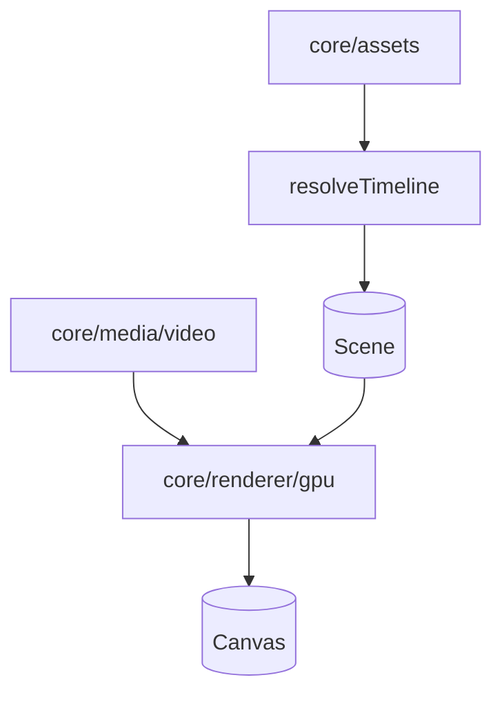

### Layer boundaries

Import rules are enforced by
[`core/media/__tests__/ImportBoundary.test.ts`](../media/__tests__/ImportBoundary.test.ts):

- `core/renderer/**` may import `core/media/video` only via the public barrel or `VideoFrameProvider` type module.
- `core/media/**` must not import from `core/renderer/**` (temporary exception: `GpuDebugCounters` during Split-01).
- `core/assets/**` must not import from `core/renderer/**` or `core/media/**`.

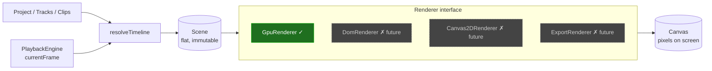

**Hard isolation rules** (every implementation must respect):

- Reads only the `Scene` it receives.
- `render(scene)` is **synchronous** and **idempotent on equal references**.
- `resize` mutates the canvas backing-store; `Scene.stage` is the logical
  coordinate space.

---

## 2. The `Renderer` interface

Four methods. Nothing else is public.

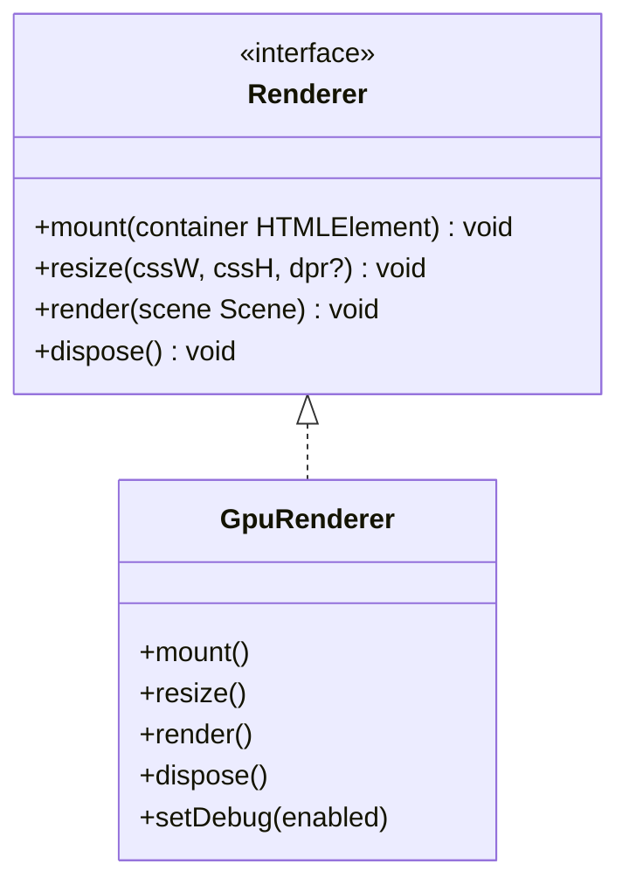

Lifecycle, in order:

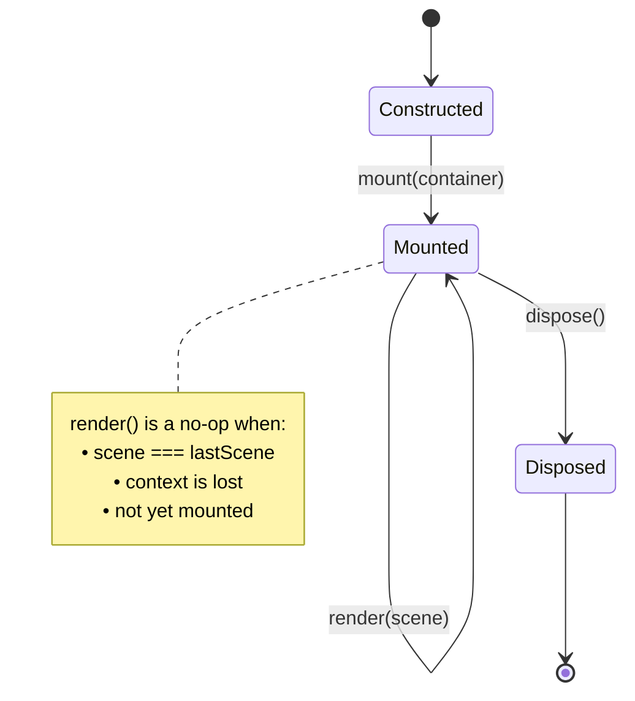

---

## 3. GPU renderer — module map

Everything under `gpu/` collaborates around one idea: turn a `Scene` into a
sorted list of textured-quad draw calls, using GPU memory that is pooled and
async work that never blocks the render path.

```mermaid
flowchart TB
    subgraph public[Public surface]
        GR[GpuRenderer]
    end

    subgraph core[Core pipeline]
        RG[RenderGraph]
        WGL[WebGLContext]
        TP[TexturePool]
        SP[ShaderProgram]
        SH[shaders/<br/>quad.vert + quad.frag]
    end

    subgraph layers[Layers]
        VL[VideoLayer]
        IL[ImageLayer]
        TXL[TextLayer]
        TL[TestLayer]
    end

    subgraph frames[Frame pipeline — core/media/video/]
        VFP[VideoFrameProvider<br/>Mock | Synthetic | StreamingFrameProducer]
        FC[FrameCache]
        VDM[VideoDecoderManager]
        DMX[MediabunnyDemuxer]
        SFP[StreamingFrameProducer]
    end

    subgraph compositing[Compositing — core/renderer/gpu/]
        VT[VideoTexture]
    end

    subgraph dbg[debug/]
        Panel[GpuRendererDebugPanel]
        DGR[DebugGpuRenderer]
        Over[DebugOverlay]
        Cnt[GpuDebugCounters]
        PG[playground.ts]
    end

    GR --> WGL
    GR --> TP
    GR --> RG
    GR --> VL
    GR --> Panel

    RG --> VL
    RG --> IL
    RG --> TXL
    RG --> TL

    VL --> VFP
    VL --> VT
    VL --> SP
    SP --> SH

    VT --> TP

    VFP --> FC
    VFP -->|demuxerFactory provided| SFP
    SFP --> VDM
    SFP --> FC
    VDM --> DMX

    Panel --> Cnt
    VFP --> Cnt
    VT --> Cnt
```

> **PR-02 wired** (2026-05-25): `createVideoFrameProvider(src, deps)` returns
> `StreamingFrameProducer` when `deps.demuxerFactory` is provided.
> The producer uses a push-based `setPlayhead` + `feed/onFrame` pipeline —
> `requestFrame` and per-frame `flush` are gone.
> `SyntheticVideoFrameProvider` (browser dev) and `MockVideoFrameProvider` (jsdom)
> remain for environments without a real demuxer.

---

## 4. `GpuRenderer` — construction & disposal order

Order is load-bearing. Disposing the pool before the graph would leak
acquired textures.

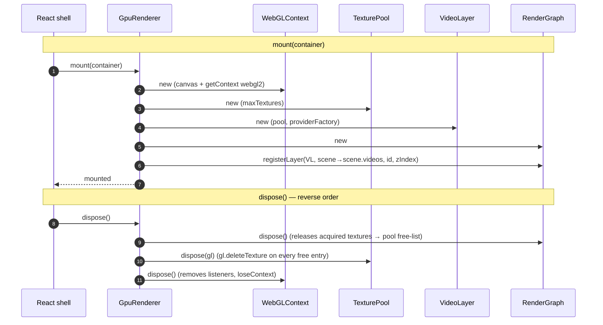

---

## 5. The render tick

Called once per RAF tick by the React shell. Synchronous from top to bottom.
Async decode/upload happens out-of-band on **subsequent** ticks.

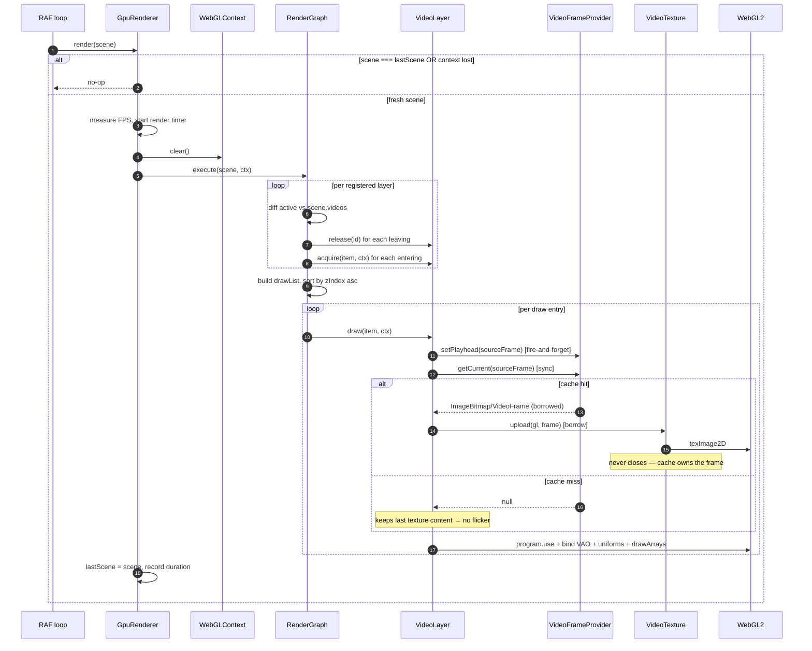

Key invariants this enforces:

- `render()` never awaits.
- `render()` never throws on a missed frame — it draws the last upload.
- Frame ownership: `upload()` borrows; the `FrameCache` is the sole closer (§10).

---

## 6. Async frame pipeline (out-of-band)

The provider is the boundary between the synchronous render thread and the
asynchronous decode/generation work. Everything below the dashed line happens
on its own schedule and reports back via the cache.

Push-based contract (PR-02): VideoLayer calls `setPlayhead(N)` before
`getCurrent(N)` on every tick. The provider drives decode internally; the
render path never schedules individual frame requests.

```mermaid
flowchart LR
    subgraph sync [Synchronous — inside render tick]
        VL[VideoLayer.draw]
        VL -- setPlayhead N --> SFP
        VL -- getCurrent N --> FC
        FC -- frame or null --> VL
    end

    SFP[StreamingFrameProducer]
    FC[(FrameCache<br/>LRU, owns frames)]
    SFP --- FC

    subgraph async [Asynchronous — feed/onFrame loop]
        FEED[manager.feed timeRangeUs]
        DECODE[VideoDecoder.output → onFrame]
        PUT[cache.put N frame]
    end

    SFP -- feed on discontinuity/lookahead --> FEED
    FEED --> DECODE
    DECODE --> PUT
    PUT --> FC

    style sync fill:#143,stroke:#3a3
    style async fill:#332,stroke:#b80
```

Cache rules (see [`FrameCache.ts`](../media/video/FrameCache.ts)):

- `put` transfers ownership to the cache.
- `get` returns a **borrowed** reference — callers must not close it.
- When full, the entry furthest from the current pivot is evicted and closed.
- The cache is the **only** thing that closes a cached frame (on evict / clear /
  dispose). `VideoTexture.upload` borrows and never closes (§10). On the real
  decode path cached frames are `ImageBitmap` copies; the decoded `VideoFrame` is
  closed earlier, in `onFrame`, before it is ever cached (§6.5).

### 6.1 Decode pipeline (PR-02 — push-based)

Full sequence from first `setPlayhead` call to frame available on the next tick:

```mermaid
sequenceDiagram
    autonumber
    participant VL as VideoLayer.draw
    participant SFP as StreamingFrameProducer
    participant FC as FrameCache
    participant VDM as VideoDecoderManager
    participant DMX as MediabunnyDemuxer

    Note over VL,DMX: Synchronous render tick (inside render())
    VL->>SFP: setPlayhead(sourceFrame) [fire-and-forget]
    Note over SFP: |Δ|>1 or first call → discontinuity → async reset
    SFP->>VDM: manager.reset(keyframeUs) [async, off render tick]
    VDM->>DMX: seekToKeyframe(keyframeUs)
    VDM->>VDM: decoder.reset() + configure()

    VL->>SFP: getCurrent(sourceFrame) [sync]
    SFP->>FC: cache.get(sourceFrame)
    FC-->>SFP: null (miss — decoder warming up)
    SFP-->>VL: null
    Note over VL: keeps last texture content → no flicker

    Note over VL,DMX: After reset completes (microtask)
    SFP->>VDM: manager.feed([startUs, endUs]) [fire-and-forget]
    VDM->>DMX: packets([startUs, endUs])
    DMX-->>VDM: EncodedVideoChunk stream
    VDM->>VDM: decoder.decode(chunk) [no per-frame flush]
    VDM->>VDM: VideoDecoder.output fires → onFrame callback
    VDM-->>SFP: onFrame(VideoFrame, sourceFrameIdx)
    SFP->>SFP: createImageBitmap(frame) then frame.close() [§6.5 copy-and-close]
    SFP->>FC: cache.put(sourceFrameIdx, bitmap) [FC owns the ImageBitmap]

    Note over VL,DMX: Next render tick (~1-3 ticks after setPlayhead)
    VL->>SFP: setPlayhead(sourceFrame+1) [contiguous → no reset]
    VL->>SFP: getCurrent(sourceFrame)
    SFP->>FC: cache.get(sourceFrame)
    FC-->>SFP: ImageBitmap (borrowed)
    SFP-->>VL: ImageBitmap
    VL->>VL: VideoTexture.upload [borrow; never closes — §10]
```

### 6.2 Blob-resolve step (Phase 1 Real Playback)

`createMediabunnyBackend` bridges the `DemuxerBackend.open(src: string)` API to
mediabunny's blob-based `Input + BlobSource`:

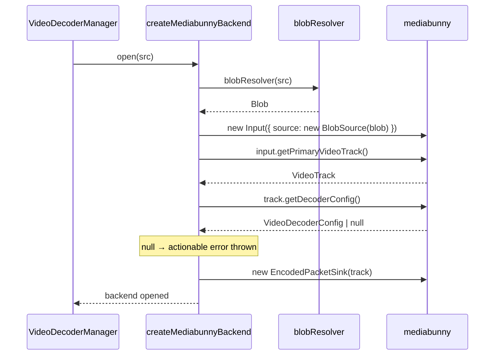

Default `blobResolver` is `fetch(src).blob()`. Override it in a custom
`DemuxerFactory` (the web app uses `createDefaultDemuxerFactory()`) to skip the
fetch round-trip for freshly-imported local files by passing the `File` object
directly.

### 6.3 Playback lifecycle (import → pixels)

End-to-end flow from file import to rendered pixels:

```mermaid
sequenceDiagram
    participant User
    participant AssetPanel
    participant Store as MediaLibraryStore
    participant Timeline
    participant Resolver as resolveTimeline
    participant GR as GpuRenderer
    participant VL as VideoLayer
    participant SFP as StreamingFrameProducer
    participant CMB as createMediabunnyBackend
    participant MB as mediabunny
    participant FC as FrameCache
    participant VT as VideoTexture

    User->>AssetPanel: drop file
    AssetPanel->>Store: importFiles → addAsset({ src: objectUrl })
    User->>Timeline: drag asset → drop on video track
    Timeline->>Store: addClip({ assetId, src: objectUrl })

    Note over Resolver,GR: RAF tick
    GR->>Resolver: resolveTimeline(frame, project)
    Resolver-->>GR: Scene { videos: [ActiveVideoClip { src }] }

    GR->>VL: draw(scene)
    VL->>SFP: setPlayhead(frame) [fire-and-forget; triggers open-time reset]
    VL->>SFP: getCurrent(frame) → null (cache miss — decoder warming up)
    Note over VL: keeps last texture content → no flicker

    Note over SFP,MB: out-of-band async (first setPlayhead triggers open + reset)
    SFP->>CMB: open(src)
    CMB->>MB: fetch + BlobSource + Input
    MB-->>CMB: VideoTrack + DecoderConfig
    CMB-->>SFP: backend ready
    SFP->>CMB: seekToKeyframe(µs)
    CMB->>MB: sink.getKeyPacket(sec)
    SFP->>CMB: feed([startµs, endµs])
    CMB->>MB: sink.getNextPacket → EncodedVideoChunk
    SFP->>SFP: VideoDecoder.decode [no per-frame flush]
    SFP->>SFP: onFrame → createImageBitmap + frame.close() → cache.put(idx, bitmap)

    Note over GR,VT: next RAF tick (~1-3 ticks later)
    GR->>VL: draw(scene)
    VL->>SFP: setPlayhead(frame) [contiguous → no reset]
    VL->>SFP: getCurrent(frame) → ImageBitmap (cache hit)
    VL->>VT: upload(ImageBitmap) → gl.texImage2D [borrow; never closes]
    VT-->>GR: texture bound
    GR->>GR: gl.drawArrays → pixels on canvas
```

### 6.4 Cache-full backpressure

`StreamingFrameProducer` avoids redundant work via a feed-watermark:

| Rule | Condition | Action |
|---|---|---|
| Cache hit | `cache.has(n)` | `getCurrent` returns frame; no feed needed |
| Watermark covered | `windowEnd <= _feedWatermark` | No-op — packets already sent to decoder |
| Contiguous advance | `\|Δ\| ≤ 1` | Feed only the new tail: `[watermark+1, N+lookahead]` |
| Discontinuity | `\|Δ\| > 1` or first call | `reset(keyframeUs)` → clear watermark → feed full window |
| Disposed | `state === 'disposed'` | All operations no-op immediately |

The decoder stays warm across contiguous `feed()` calls — no per-frame `flush()`.
`flush()` is called only in `drain()` during dispose.

---

## 6.5 — Plain-English: the decoder pool, the freeze, and the fix

> Read this if §6 and §10 felt abstract. Same story, no jargon. **This is the
> exact boundary that caused the "freeze after ~18 frames" bug.**

### A `VideoFrame` is a *borrowed library book*, not a photo

The hardware video decoder is a tiny library with a **fixed shelf of ~16 books**
(its internal frame pool). Each time it decodes a picture it hands you one
**book** — a `VideoFrame`. A `VideoFrame` is **not** a copy of the pixels; it is
a *borrowed handle* to one shelf slot inside the decoder.

The library's rule:

- You may **read** the book (upload it to the GPU).
- You must **return** it (`frame.close()`) so the slot frees up.
- If you **keep** books, the shelf empties. With an empty shelf the librarian
  (decoder) **cannot make new books** — it just stops. No error, no crash. It
  freezes, and `flush()` waits forever for a slot that never comes back.

```
Decoder's shelf (≈16 slots):
[📕][📕][📕][📕][📕][📕][📕][📕][📕][📕][📕][📕][📕][📕][  ][  ]
 every 📕 = one VideoFrame you are still holding open
 keep ~16 open  →  shelf full  →  decoder can't decode  →  FREEZE
```

### What the code USED to do (the bug that was fixed) ❌

The `FrameCache` stored the **raw book** and only returned it much later, on
eviction. But the cache was sized at 30 while only ~14 frames ever decode, so
**eviction never fired → no book was ever returned → the shelf filled → freeze.**

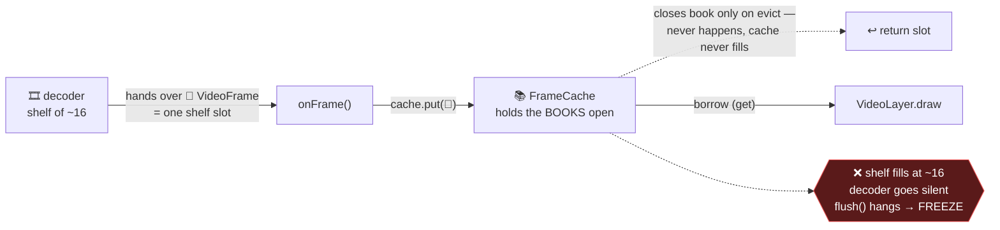

👉 **The breaking arrow was `cache.put(📕)`** — the cache held the *book itself*.
That was the one line the fix changed.

### The fix (shipped): photocopy the book, return the original immediately ✅

`createImageBitmap(frame)` makes a **photocopy** on plain paper. The photocopy
(`ImageBitmap`) is yours forever and costs the decoder **nothing**. So we copy,
hand the book straight back (`frame.close()`), then cache the photocopy.

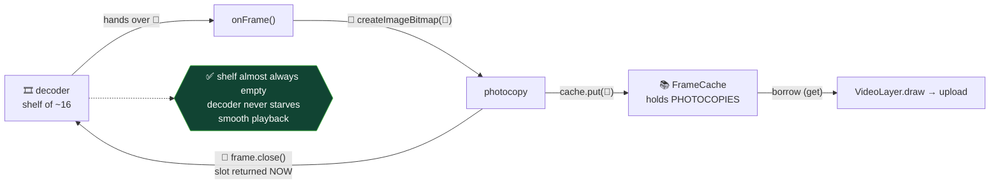

|  | Holds a decoder slot? | How many can exist? | Survives a GPU reset? |
|---|:--:|:--:|:--:|
| `VideoFrame` (book) | **Yes** — pins 1 of ~16 | ~16, then freeze | yes (not a GPU object) |
| `ImageBitmap` (photocopy) | **No** | limited only by RAM | yes |

**One-line summary of the fix:** move `frame.close()` from *"later, on cache
eviction"* to *"**right now**, the instant we've photocopied it."* That single
move is what unfreezes playback.

### Knock-on simplification (also shipped)

[`VideoLayer.draw`](./gpu/layers/VideoLayer.ts) used to call `frame.clone()`
before upload, because **two owners** both thought they must close the frame: the
cache **and** `VideoTexture.upload`'s `finally`. Cloning was a smell that said
*"nobody agreed who owns this."* Now the cache holds a photocopy that only **it**
owns, the clone is gone, and `upload()` simply **borrows**. The whole pipeline
collapses to one sentence:

> **The FrameCache owns every cached frame and is the only thing that closes it.
> Everyone else borrows and never closes.**

Implementation: the copy-and-close happens in
[`StreamingFrameProducer`](../media/video/StreamingFrameProducer.ts)
`onFrame → _copyAndCache`; the cache is `FrameCache<ImageBitmap>`;
[`VideoTexture.upload`](./gpu/VideoTexture.ts) accepts `VideoFrame | ImageBitmap`
and never closes its argument.

---

## 6.6 — Plain-English: why the decode side is "GL-free"

> This is question 7. Short version: the decode side must keep working even when
> the GPU throws everything away.

### Two zones: the GPU can be wiped, plain memory cannot

A WebGL context can be **lost at any second** — driver reset, laptop sleep, tab
backgrounded too long. When that happens **every GPU object is instantly dead**:
textures, shaders, all of it. Plain JavaScript memory is untouched. So we draw a
hard line through the system:

```
   ┌────────────────────────────────────────────────┐
   │  🖥️  GPU ZONE — can be WIPED at any moment        │
   │  VideoTexture · ShaderProgram · TexturePool      │  ← rebuilt on restore
   └────────────────────────────────────────────────┘
   ═══════════════ the GL-free line ═══════════════════
   ┌────────────────────────────────────────────────┐
   │  💾  SAFE MEMORY ZONE — survives a GPU reset       │
   │  StreamingFrameProducer · VideoDecoderManager    │
   │  Demuxer · FrameCache (VideoFrame / ImageBitmap) │  ← keeps running
   └────────────────────────────────────────────────┘
```

When the GPU comes back, the next `render()` re-uploads from the **surviving
cache** — no re-decode, no stutter (see §9).

### What would break if SFP held GPU textures

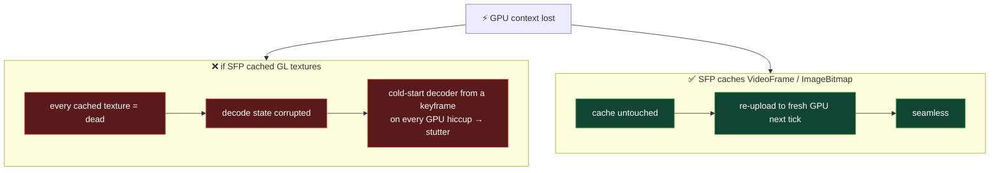

Both `VideoFrame` and `ImageBitmap` are valid `TexImageSource` — either can be
uploaded to a **brand-new** GPU context. That's why the §6.5 fix (book →
photocopy) keeps this property intact: a photocopy is just as re-uploadable as a
book, and just as safe below the GL-free line.

---

## 7. `VideoLayer` — provider & texture bookkeeping

`VideoLayer` is the only place that knows clips share decoders. Providers are
keyed by `src` and ref-counted across clips; textures are keyed by clip `id`.

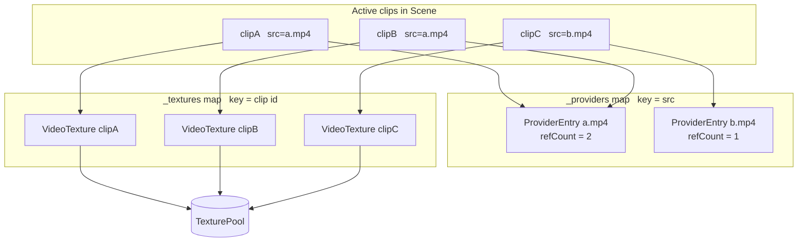

- `acquire(item)` → new `VideoTexture`, bump or create the provider entry.
- `release(id)`   → dispose the texture, decrement refCount, `markIdle()` at 0.
- `draw(item)`    → see render-tick diagram above.

---

## 8. `VideoDecoderManager` state machine

Fully implemented and tested. Owned by `StreamingFrameProducer` (one instance
per provider). Holds **no** GL objects, so it is immune to context loss.

API: `feed(timeRangeUs)`, `reset(toKeyframeUs)`, `drain()`, `onFrame` callback.

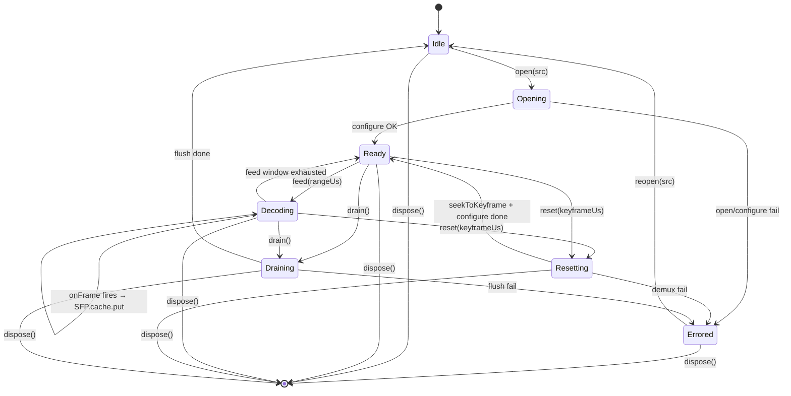

Behavioural guarantees (PR-02):

- `feed()` never calls `decoder.flush()` mid-stream; the decoder stays warm
  across contiguous frame ranges.
- `reset()` bumps `_feedGeneration` so any in-progress `feed()` loop
  abandons its remaining packets without calling `decode()`.
- `onFrame` is called from `VideoDecoder.output`; `StreamingFrameProducer`
  checks generation before calling `cache.put` and closes stale frames.
- `drain()` calls `decoder.flush()` exactly once, then waits for the flush
  to propagate through `output` before resolving.

---

## 9. Context loss & recovery

Browser GPU context loss can happen at any time (tab backgrounded, driver
reset, alt-tab). The renderer survives it because no module silently assumes
its GL handles are still valid.

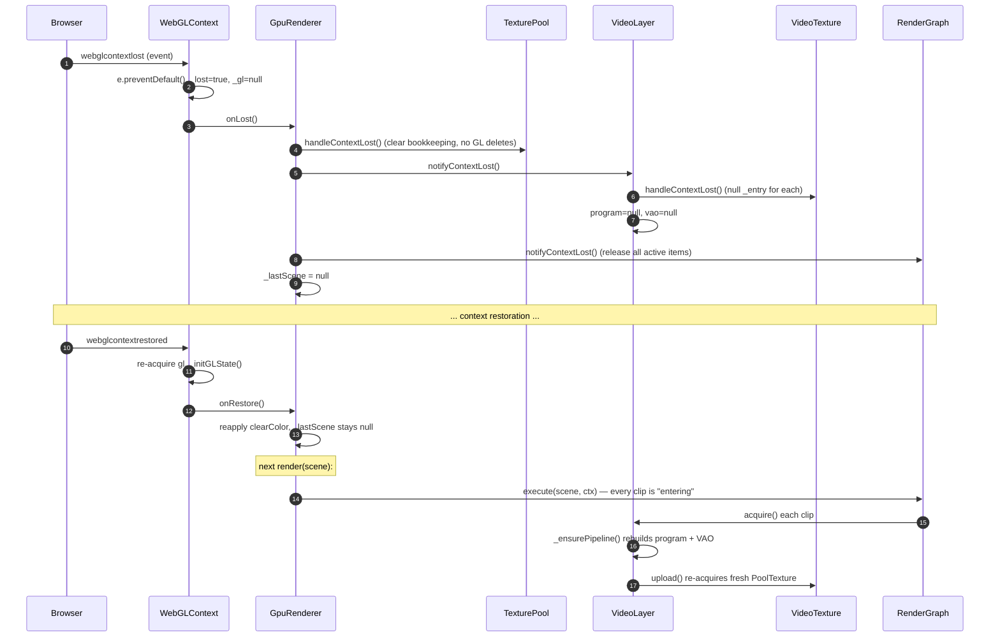

| Module                | Holds GL? | Recovery strategy                                 |
|-----------------------|:--------:|---------------------------------------------------|
| `WebGLContext`        | yes (the context itself) | re-`getContext` on restore, re-run `_initGLState` |
| `TexturePool`         | yes      | `handleContextLost()` clears handles, no deletes  |
| `VideoTexture`        | yes      | `handleContextLost()` nulls `_entry`; re-acquires on next upload |
| `VideoLayer`          | yes (program + VAO) | nulls them; `_ensurePipeline()` rebuilds         |
| `RenderGraph`         | no       | releases all active items; next tick re-acquires  |
| `FrameCache`          | no       | unchanged                                          |
| `VideoDecoderManager` | no       | unchanged                                          |

---

## 10. Frame ownership — single rule, end-to-end

> ✅ **Copy-and-close shipped.** The old "two owners + clone" model is gone. The
> `FrameCache` is now the **single owner** and the **only closer** of every cached
> frame; everyone else borrows and never closes. See **§6.5** for the why.

This is the one rule that, if violated, leaks GPU memory or freezes playback.

On the real decode path the cache holds **`ImageBitmap`** copies — the decoded
`VideoFrame` is closed inside `onFrame` the instant the copy exists, so it never
reaches the cache or the renderer. On the synthetic dev path the cache holds
`VideoFrame`s directly (no pool pressure there). Either way the rule is the same:

```mermaid
flowchart LR
    A[VideoDecoder.output] -->|VideoFrame| ONF[onFrame]
    ONF -->|createImageBitmap| COPY[ImageBitmap copy]
    ONF -->|frame.close → return pool slot| Xd((VideoFrame closed<br/>in onFrame))
    COPY -->|cache.put| FC[FrameCache<br/>SOLE OWNER]
    FC -->|borrow via get| VL[VideoLayer.draw]
    VL -->|borrow, never close| VT[VideoTexture.upload]

    FC -.LRU evict.-> X((bitmap.close))
    FC -.dispose / clear.-> X

    classDef owner fill:#143,stroke:#3a3
    class FC owner
```

The only thing that closes a **cached** frame is the `FrameCache` itself, on
eviction / clear / dispose — exactly once. `VideoTexture.upload` and
`VideoLayer.draw` only read the borrowed frame; neither closes it. The decoded
`VideoFrame` is a separate lifetime, closed in `onFrame` before it is ever cached
(this is what keeps the decoder's output pool from filling — see §6.5).

---

## 11. Debug pipeline (optional)

Imported only when needed. Zero impact on production rendering.

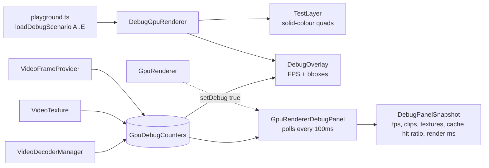

The debug renderer is a **parallel** implementation that shares only
`WebGLContext`, `TexturePool`, and `RenderGraph` — it exists to exercise the
shader / transform / zIndex paths without any decode plumbing.

---

## 12. What is done vs. what is next


---

## File index (quick jump)

| Concern                   | File                                                                 |
|---------------------------|----------------------------------------------------------------------|
| Public interface          | [`types.ts`](./types.ts)                                             |
| GPU entry point           | [`gpu/GpuRenderer.ts`](./gpu/GpuRenderer.ts)                         |
| Scene diff / dispatch     | [`gpu/RenderGraph.ts`](./gpu/RenderGraph.ts)                         |
| GL context + recovery     | [`gpu/WebGLContext.ts`](./gpu/WebGLContext.ts)                       |
| Texture allocator         | [`gpu/TexturePool.ts`](./gpu/TexturePool.ts)                         |
| Shader helper             | [`gpu/ShaderProgram.ts`](./gpu/ShaderProgram.ts) + [`gpu/shaders/`](./gpu/shaders) |
| Video layer               | [`gpu/layers/VideoLayer.ts`](./gpu/layers/VideoLayer.ts)             |
| Per-clip GPU texture      | [`gpu/VideoTexture.ts`](./gpu/VideoTexture.ts)                       |
| Frame access boundary     | [`../media/video/VideoFrameProvider.ts`](../media/video/VideoFrameProvider.ts) |
| Decoded-frame cache       | [`../media/video/FrameCache.ts`](../media/video/FrameCache.ts)     |
| Decoder + state machine   | [`../media/video/VideoDecoderManager.ts`](../media/video/VideoDecoderManager.ts) |
| Demuxer adapter           | [`../media/video/demuxer/MediabunnyDemuxer.ts`](../media/video/demuxer/MediabunnyDemuxer.ts) |
| mediabunny backend adapter | [`../media/video/demuxer/createMediabunnyBackend.ts`](../media/video/demuxer/createMediabunnyBackend.ts) |
| Push-based frame producer | [`../media/video/StreamingFrameProducer.ts`](../media/video/StreamingFrameProducer.ts) |
| Media layer overview      | [`../media/README.md`](../media/README.md)                           |
| Debug renderer & overlay  | [`gpu/debug/`](./gpu/debug)                                          |
| Recording GL (test only)  | [`gpu/debug/RecordingGl.ts`](./gpu/debug/RecordingGl.ts)            |
| Renderer tests            | [`gpu/__tests__/`](./gpu/__tests__)                                  |
| Media/decode tests        | [`../media/video/__tests__/`](../media/video/__tests__)              |
| Import boundary tests     | [`../media/__tests__/ImportBoundary.test.ts`](../media/__tests__/ImportBoundary.test.ts) |
