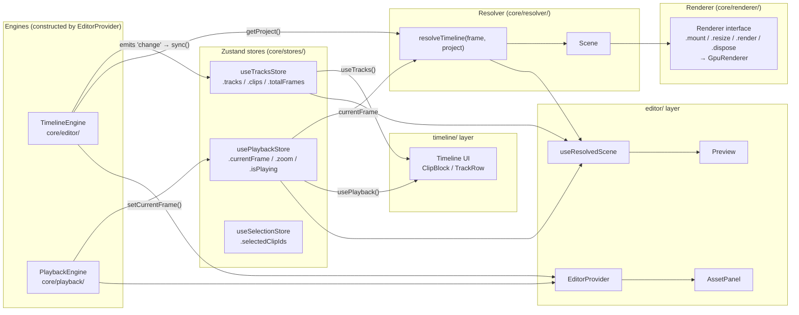

# `@elah/core` Architecture Reference

> **Purpose of this document:** A self-contained cold-start reference for any
> implementation agent working on the engine layer. Load this file and you will
> not need to re-explore `packages/core/src/` from scratch.
>
> **Scope:** the shipped engine — the `@elah/core` package plus the GPU renderer,
> decode pipeline, audio, and export that sit beside it.
>
> **Note:** the codebase is split into three published packages. The `core/X`
> paths below are shorthand for `packages/core/src/X` (the `@elah/core` package).

---

## 1. Position in the three-package architecture

```
packages/
  core/       (@elah/core)     ← THIS DOCUMENT — runtime; framework-agnostic
  timeline/   (@elah/timeline) ← timeline UI surface; imports @elah/core
  editor/     (@elah/editor)   ← composition: EditorProvider, hooks, Preview, AssetPanel
```

**Dependency rule (enforced by the package graph):**

```
@elah/core  ←  @elah/timeline  ←  @elah/editor
```

- `@elah/core` may **not** import from `@elah/timeline` or `@elah/editor`.
- `@elah/timeline` may **not** import from `@elah/editor`.
- `@elah/editor` may import from both (and re-exports them).

---

## 2. Directory map

| Folder | Role | Key exports |
|--------|------|-------------|
| `core/types/` | Shared domain types. All time values are integer frame counts. | `Project`, `Track`, `Clip`, `Transform`, `ClipType`, `TrackKind`, `EngineEvent` |
| `core/editor/` | `TimelineEngine` — the authoritative project state machine. Immer mutations, undo/redo history, event emitter. | `TimelineEngine` |
| `core/playback/` | `PlaybackEngine` — frame ticker, RAF loop, transport controls. Reads `currentFrame` from `PlaybackStore` and advances it. | `PlaybackEngine` |
| `core/resolver/` | Pure, deterministic frame resolver. `resolveTimeline(frame, project) → Scene`. No DOM, no React. | `resolveTimeline`, `Scene` (and sub-types) |
| `core/renderer/` | `Renderer` interface + the shipped WebGL2 `GpuRenderer` (`gpu/`): video/image/text layers, `RenderGraph`, context-loss recovery, shared placement helpers. | `Renderer`, `GpuRenderer` |
| `core/media/` | Frame/sample producers. `media/video/` = WebCodecs decode (`StreamingFrameProducer`, `FrameCache`, mediabunny demuxer); `media/audio/` = `AudioPlaybackController`. | `createVideoFrameProvider`, `StreamingFrameProducer`, `AudioPlaybackController` |
| `core/export/` | `exportVideo()` + `ExportWorker` — OffscreenCanvas frame render → mediabunny MP4 mux. | `exportVideo` |
| `core/debug/` | Channel-based `trace()` frame-lifecycle logging (`window.__trace`). | `trace`, `traceEnabled` |
| `core/stores/` | Zustand stores that mirror engine state into React. Components subscribe with granular selectors. | `useTracksStore`, `usePlaybackStore`, `useSelectionStore`, `useTransitionsStore` |
| `core/assets/` | `MediaLibrary` — in-memory asset registry. Zustand store + typed hooks. Drag MIME constant. File import + thumbnail generation. | `useMediaLibrary`, `useMediaLibraryStore`, `importFiles`, `MEDIA_DRAG_MIME`, `MediaAsset` |
| `core/elements/` | Clip factory functions. Pure constructors, no side-effects. | `createVideoClip`, `createAudioClip`, `createTextClip`, `createImageClip` |
| `core/track/` | Track factory. | `createTrack` |
| `core/actions/` | Compound operations (multi-step mutations + engine calls). Currently: `splitClipAtPlayhead`. | `splitClipAtPlayhead` |
| `core/visitor/` | Immer-based project mutation primitives. Used internally by `TimelineEngine`. Not exported publicly. | `addClip`, `removeClip`, `updateClip`, `splitClip`, `cloneClip`, `removeTrack`, `updateTrack` |
| `core/utils/` | Pure helpers: frame math, timecode formatting, snap, ID generation. | `framesToTimecode`, `secondsToFrames`, `framesToSeconds`, `getTotalFrames`, `generateId` |
| `core/editor-context.ts` | React context + hooks that expose the engines to the component tree. Lives in `core/` so `editor/` and `timeline/` can both import without a circular dependency. | `useEditor`, `useTimelineEngine`, `usePlaybackEngine`, `EditorContext` |

---

## 3. Key type relationships

```
TimelineConfig
    │
    ▼ (constructor)
TimelineEngine
    │
    ├── getProject() ──────────────► Project
    │                                   │
    │                              ┌────┴─────┐
    │                           Track[]    clips: Record<trackId, Clip[]>
    │
    └── on('change', handler) ──► Project  (emitted after every mutation)

resolveTimeline(frame: number, project: Project) ──► Scene
                                                         │
                                          ┌──────────────┼──────────────────┐
                                    ActiveVideoClip[]  ActiveAudioClip[]  ActiveTextClip[]
                                    ActiveImageClip[]  SceneTransition[]

Renderer (interface)
    ├── mount(container: HTMLElement)
    ├── resize(cssW, cssH, dpr?)
    ├── render(scene: Scene)           ◄── consumes only Scene; never Project
    └── dispose()
    └── implemented by GpuRenderer (core/renderer/gpu/)
```

**`Clip` fields** worth knowing:

| Field | Meaning |
|-------|---------|
| `startFrame` | Position on the timeline (frame index where the clip starts) |
| `durationFrames` | Length of the clip on the timeline |
| `sourceStartFrame` | Trim in-point into the source asset |
| `sourceDurationFrames` | Full length of the source asset (for trim constraints) |
| `assetId?` | Reference to a `MediaAsset` in the `MediaLibrary` (preferred over raw `src` when set) |
| `transform?` | Normalized spatial transform `{x, y, scale, rotation, anchor}` — undefined means renderer default |

---

## 4. Runtime data-flow diagram



---

## 5. Store contracts

### `useTracksStore` (`core/stores/tracks.store.ts`)

Mirrors `Project` from the engine into React. **Never mutate directly** — always go through the engine.

| Field | Type | Description |
|-------|------|-------------|
| `tracks` | `Track[]` | Reference changes on every engine `'change'` event |
| `clips` | `Record<string, Clip[]>` | Indexed by `trackId` |
| `totalFrames` | `number` | Computed max end frame across all clips |
| `canUndo` / `canRedo` | `boolean` | Engine history state |
| `sync(project, meta)` | method | Called by `<Timeline>` in its engine `'change'` listener |

The `tracks` reference replacement on every `sync()` call is the cheapest "project mutated" signal. `useResolvedScene` subscribes to it via `useTracksStore((s) => s.tracks)` purely for this trigger.

### `usePlaybackStore` (`core/stores/playback.store.ts`)

Partially persisted to `localStorage` key `myeditor-playback`. Persisted fields: `zoom`, `volume`, `muted`, `playbackRate`, `loop`, `snapEnabled`.

| Field | Description |
|-------|-------------|
| `currentFrame` | Current playhead position (integer frames) |
| `currentFrameEpoch` | Monotonically incremented counter; detects repeat seeks to the same frame |
| `isPlaying` | Transport state |
| `zoom` | Pixels per frame (timeline zoom level) |
| `snapEnabled` | Snap-to-grid toggle |

### `useSelectionStore` (`core/stores/selection.store.ts`)

Holds `selectedClipIds: string[]`. Not mirrored from the engine — selection is a pure UI concern.

---

## 6. `TimelineEngine` event model

The engine is a typed event emitter. Listeners registered with `.on(event, handler)` are called synchronously after each mutation.

| Event | Payload | When fired |
|-------|---------|------------|
| `'change'` | `Project` | After **every** mutation (broadest trigger) |
| `'track:added'` | `Track` | After `addTrack()` |
| `'track:removed'` | `string` (trackId) | After `removeTrack()` |
| `'clip:added'` | `Clip` | After `addClip()` |
| `'clip:removed'` | `{ clipId, trackId }` | After `removeClip()` |
| `'clip:updated'` | `Clip` | After `updateClip()`, `moveClip()`, `trimClip()` |
| `'clip:split'` | `{ leftId, rightId, trackId }` | After `splitClip()` |
| `'transition:added'` | `Transition` | After `addTransition()` |
| `'transition:removed'` | `string` (transitionId) | After `removeTransition()` |
| `'history:change'` | `{ canUndo, canRedo }` | After any mutation or undo/redo |

`<Timeline>` subscribes to `'change'` and calls `useTracksStore.sync()`. That is the only bridge between the engine and React stores.

---

## 7. `resolveTimeline` guarantees

- **Pure and deterministic** — same `(frame, project)` always produces structurally equal output.
- **No side-effects** — safe in tests, Web Workers, WASM export pipelines.
- **No DOM, no React, no Zustand** — plain data in, plain data out.
- Respects `track.disabled`, `clip.disabled`, `track.muted`, `track.solo`.
- Output arrays are sorted ascending by `zIndex`; index 0 = furthest back, last = front.
- `zIndex` is derived from `track.order` × 1000, leaving room for future sub-layer offsets.

---

## 8. `MediaLibrary` (`core/assets/`)

In-memory registry of source assets. Not yet persisted (IndexedDB/OPFS arrives in Phase 3).

- `importFiles(files, opts?)` — takes `File[]`, creates object URLs, probes metadata via `<video>` / `<audio>` / ``, registers `MediaAsset`s in the store, and generates thumbnails asynchronously on the main thread (`thumbnailUrl` patched via `updateAsset`)
- `useMediaLibrary()` — React hook for reading assets in insertion order (`getAsset`, ordered `assets` list)
- `useMediaLibraryStore` — raw Zustand store for granular subscriptions and imperative access (`addAsset`, `removeAsset`, `updateAsset`, `getAsset`)
- `MEDIA_DRAG_MIME = 'application/x-elah-media'` — MIME type placed on `dataTransfer` when dragging from `AssetPanel`
- `DragMediaPayload = { kind: 'media-asset'; assetId: string }` — JSON-encoded payload

**Import flow:**

```
File[] → importFiles()
  ├─ infer kind from MIME (video/audio/image; skip unknown)
  ├─ URL.createObjectURL(file) → asset.src
  ├─ probe metadata (duration, width, height)
  ├─ addAsset() — returns immediately (no thumbnailUrl yet)
  └─ scheduleThumbnail() — fire-and-forget; updateAsset({ thumbnailUrl }) when ready
```

`sourceFps` extraction (mediabunny / MP4Box.js) and audio waveform peaks are deferred to later PRs.

---

## 9. What is NOT in `core/`

Knowing what is absent is as important as knowing what is present:

| Concern | Lives in |
|---------|----------|
| `<Timeline>` component, `<ClipBlock>`, `<TrackRow>`, `<Ruler>`, `<Playhead>` | `@elah/timeline` |
| `useTracks`, `usePlayback`, `useSelection` hooks (public API) | `@elah/timeline` (`src/hooks/`) |
| `useTimeline`, `useTimelineDrop` drop handler | `@elah/timeline` (`src/`) |
| `<EditorProvider>` | `@elah/editor` (`src/editor/`) |
| `useResolvedScene` | `@elah/editor` (`src/editor/`) |
| `<Preview>` component (mounts the renderer + RAF) | `@elah/editor` (`src/editor/Preview/`) |
| `<AssetPanel>`, `<ElementsPanel>`, `<SourcePanel>` components | `@elah/editor` (`src/editor/`) |

---

## 10. What's next for `core/`

The engine, renderer, decode pipeline, audio, and export have all landed. The
next architectural layer is a **scheduler / media-coordination** system above the
frame providers (predictive caching, reverse-scrub strategy, cross-clip decode
prioritization). See [`ROADMAP.md`](../../../../ROADMAP.md) and
[`CURRENT_LIMITATIONS.md`](../../../../CURRENT_LIMITATIONS.md). It is expected to
sit between `core/renderer/` and `core/media/video/` without changing the
`VideoFrameProvider` interface.
