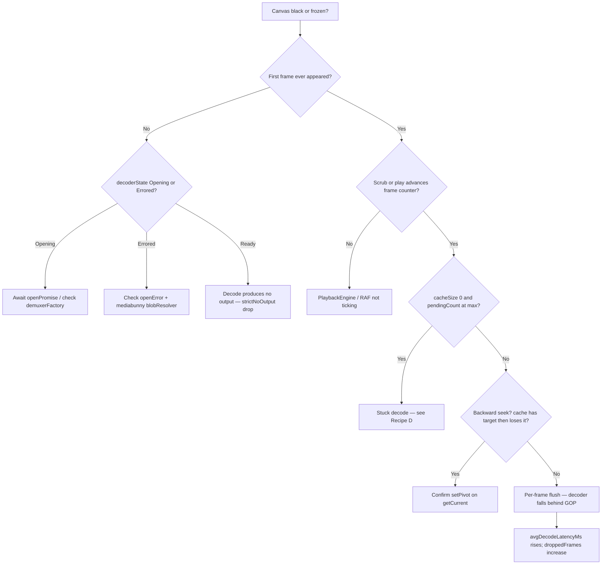
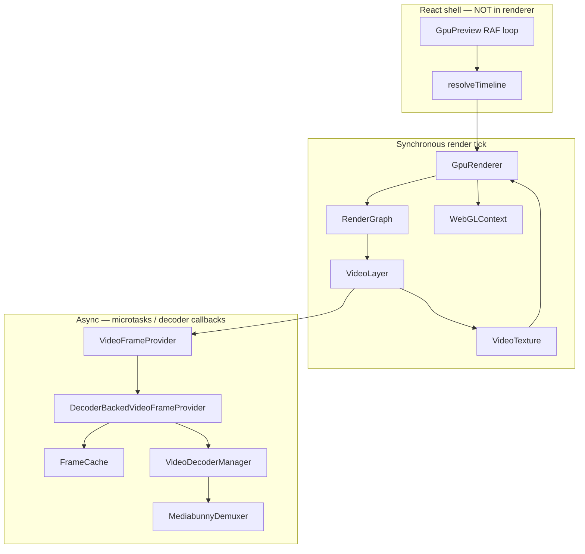
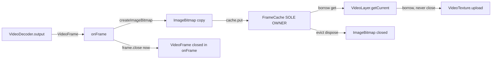

# OPTIMIZATION.md — layer playbook + consistency audit

A **triage and study workbench** for the GPU renderer. Use this when video does not play, when you want to test one layer in isolation, or when you need to understand how the renderer fits the rest of `@elah/editor`.

> ⚠️ **Out of date — predates the PR-02 push-based rewrite and the package split.**
> This playbook was written against the original **pull-based** decode pipeline.
> Two things have since changed and the per-layer drill-downs below have **not**
> all been rewritten:
>
> 1. **Pull → push.** The production provider is now
>    `StreamingFrameProducer` (push-based: `setPlayhead(n)` + sync `getCurrent(n)`),
>    not `DecoderBackedVideoFrameProvider` (deprecated). There is no
>    `requestFrame` / `prefetch` / `manager.seek()` and **no per-frame
>    `decoder.flush()`** — the decoder stays warm via `feed()`/`onFrame()` and
>    only flushes once in `drain()`. The cache holds **`ImageBitmap` copies**
>    (copy-and-close in `onFrame`), so `VideoTexture.upload` **borrows and never
>    closes** — the old `frame.clone()`-before-upload step is gone.
> 2. **Package split + relocation.** The renderer and decode pipeline live in the
>    **`@elah/core`** package now. Decode/cache code is under
>    `packages/core/src/media/video/` (not `gpu/`), and compositing under
>    `packages/core/src/renderer/gpu/`.
>
> For the current model see the canonical companions below. Treat §3/§8/§9 here
> as historical context for the pre-PR-02 pipeline.

**Canonical companions (current source of truth — all in `@elah/core`):**

| Doc | Role |
|-----|------|
| [`renderer/architecture.md`](../../../../core/src/renderer/architecture.md) | Diagrams and contracts (push-based) |
| [`renderer/EVOLUTION.md`](../../../../core/src/renderer/EVOLUTION.md) | History and reasoning |
| [`renderer/README.md`](../../../../core/src/renderer/README.md) | Public API and wiring |
| [`renderer/AI-Rules.md`](../../../../core/src/renderer/AI-Rules.md) | Invariants agents must preserve |
| [`renderer/gpu/IMPLEMENTATION_NOTES.md`](../../../../core/src/renderer/gpu/IMPLEMENTATION_NOTES.md) | Why decisions were made |
| [`renderer/gpu/README.md`](../../../../core/src/renderer/gpu/README.md) | GPU module map |
| [`media/video/README.md`](../../../../core/src/media/video/README.md) | Decode pipeline contract |

---

## Table of contents

1. [TL;DR — why the video doesn't play](#1-tldr--why-the-video-doesnt-play)
2. [Layer map at a glance](#2-layer-map-at-a-glance)
3. [Per-layer drill-down](#3-per-layer-drill-down)
4. [End-to-end smoke recipes](#4-end-to-end-smoke-recipes)
5. [Cross-package architectural consistency](#5-cross-package-architectural-consistency)
6. [Reference notes — freecut](#6-reference-notes--freecut)
7. [Reference notes — twick](#7-reference-notes--twick)
8. [Anti-patterns hall of fame](#8-anti-patterns-hall-of-fame)
9. [Open work / TODOs that still cause the symptom](#9-open-work--todos-that-still-cause-the-symptom)
10. [How to use this doc](#10-how-to-use-this-doc)

---

## 1. TL;DR — why the video doesn't play

Real playback is **async decode feeding a synchronous render tick**. When anything in that bridge fails, the canvas keeps drawing the **last uploaded texture** (by design — no flicker on cache miss). That looks like "first frame stuck" or "video frozen."

### Three coupled bugs (seek / stuck-frame family)

These compose; fixing only one often leaves the symptom:

> The three bugs below were the original (pull-based) symptom family. All three
> are resolved in the current push-based pipeline; the file/method names reflect
> the **old** code and are kept for historical traceability.

| # | Bug | Status | Where (then → now) |
|---|-----|--------|--------------------|
| 1 | **FrameCache evicted the seek anchor** — lowest-key eviction removed backward-seek targets while prefetch siblings filled the cache | **Fixed** — pivot-relative `_evictFurthest()` | `FrameCache.ts` (now `packages/core/src/media/video/FrameCache.ts`) |
| 2 | **No seek on discontinuity** — stale in-flight decodes could land after a scrub | **Fixed** — push-based `setPlayhead` now triggers `manager.reset(keyframeUs)` on `\|Δframe\| > 1` (was `requestFrame` → `manager.seek()`) | `StreamingFrameProducer.ts` (was `DecoderBackedVideoFrameProvider.ts`) |
| 3 | **Per-frame `decoder.flush()`** — after flush, WebCodecs needs a keyframe again; every tick re-decodes the whole GOP | **Fixed by PR-02** — `feed()` never flushes mid-stream; the decoder stays warm across contiguous ranges; `flush()` runs once in `drain()` | `VideoDecoderManager.ts` |

### Other fixes already landed

| Fix | Why it mattered |
|-----|-----------------|
| **Copy-and-close** (`createImageBitmap` + `frame.close()` in `onFrame`) | Replaced the old `frame.clone()`-before-upload hack. The cache now owns `ImageBitmap` copies and is the **sole closer**; `VideoTexture.upload` borrows and never closes. Holding raw `VideoFrame`s used to drain the decoder's ~16-slot pool → freeze. |
| Stall watchdog (progress-based reset) | A decoder that goes silent while fed ahead of the playhead triggers one reset (replaced the old per-request `decodeTimeoutMs` slot timeout). |
| `UNPACK_FLIP_Y_WEBGL` in `_initGLState` | Upside-down video; easy to misread as "wrong frame" |

### Decision tree — "is it working?"



**Fast console filter:** in DevTools, filter `[GPU-TRACE]`. Repeating `{pendingCount:4, cacheSize:0, gotFrame:false}` means the decode bridge is wedged, not the GL draw path.

---

## 2. Layer map at a glance

Execution order on each RAF tick (top → bottom). **Owner** = who holds mutable state. **Blast radius** = what breaks downstream if this layer fails.



| Layer | File | Owner state | Blast radius if broken |
|-------|------|-------------|------------------------|
| `GpuRenderer` | [`gpu/GpuRenderer.ts`](./gpu/GpuRenderer.ts) | `_lastScene`, viewport, FPS | Nothing draws; or no-op forever if scene ref stable |
| `RenderGraph` | [`gpu/RenderGraph.ts`](./gpu/RenderGraph.ts) | `activeItems` per layer | Leaked textures; clips never acquired |
| `VideoLayer` | [`gpu/layers/VideoLayer.ts`](./gpu/layers/VideoLayer.ts) | `_providers`, `_textures` | No upload; wrong src sharing |
| `VideoFrameProvider` | [`gpu/VideoFrameProvider.ts`](./gpu/VideoFrameProvider.ts) | (interface) | Wrong backend selected |
| `DecoderBackedVideoFrameProvider` | [`gpu/DecoderBackedVideoFrameProvider.ts`](./gpu/DecoderBackedVideoFrameProvider.ts) | `_pending`, `_cache`, `_manager` | Cache never fills; seek stuck |
| `FrameCache` | [`gpu/FrameCache.ts`](./gpu/FrameCache.ts) | `_frames`, `_pivot` | Wrong frame evicted; memory leak |
| `VideoDecoderManager` | [`gpu/VideoDecoderManager.ts`](./gpu/VideoDecoderManager.ts) | state machine, decode queue | Errored decoder; no frames |
| `MediabunnyDemuxer` | [`gpu/demuxer/MediabunnyDemuxer.ts`](./gpu/demuxer/MediabunnyDemuxer.ts) | `_backend` | open() fails; no packets |
| `createMediabunnyBackend` | [`gpu/demuxer/createMediabunnyBackend.ts`](./gpu/demuxer/createMediabunnyBackend.ts) | per-backend blob/input | fetch/blob failures |
| `VideoTexture` | [`gpu/VideoTexture.ts`](./gpu/VideoTexture.ts) | `_entry`, `_hasContent` | texImage2D fails; stale pixels |
| `TexturePool` | [`gpu/TexturePool.ts`](./gpu/TexturePool.ts) | free list (cap 16) | upload returns false |
| `WebGLContext` | [`gpu/WebGLContext.ts`](./gpu/WebGLContext.ts) | canvas, `_gl`, `_lost` | Context loss; no GL |

---

## 3. Per-layer drill-down

Each subsection uses the same schema: **Contract → I/O & ownership → Silent breaks → Isolation oracle → Live debug hooks**.

Run tests from `video-editor/packages/editor`:

```bash
cd video-editor/packages/editor
npm test -- --run gpu/__tests__/FrameCache.test.ts
npm test -- --run -t "evicts the entry furthest from pivot"
```

---

### 3.1 GpuRenderer

**Contract:** `render()` is synchronous, idempotent on equal `Scene` references, never awaits.

**Inputs / outputs / ownership:**

- **In:** immutable `Scene` from caller (shell resolves each tick).
- **Out:** pixels on canvas via `RenderGraph.execute`.
- **Owns:** `WebGLContext`, `TexturePool`, `VideoLayer`, `RenderGraph`, debug panel.

**How it can silently break:**

1. **`scene === lastScene` early return** — if the shell passes the same object reference while `currentFrame` changed inside it, render skips. Resolver must produce a new `Scene` per frame (or the reference must change).
2. **Context lost** — `isLost` → no-op; canvas frozen until restore + `_lastScene = null`.
3. **`preserveDrawingBuffer: false`** — Playwright `readCanvas()` returns zeros while canvas looks fine on screen.

**Isolation oracle:**

| Test | Command |
|------|---------|
| [`gpu/__tests__/RenderSynchronization.test.ts`](./gpu/__tests__/RenderSynchronization.test.ts) | `npm test -- --run gpu/__tests__/RenderSynchronization.test.ts` |
| [`gpu/__tests__/PerformanceMetrics.test.ts`](./gpu/__tests__/PerformanceMetrics.test.ts) | `npm test -- --run gpu/__tests__/PerformanceMetrics.test.ts` |

**Live debug hooks:** `renderer.setDebug(true)` → `GpuRendererDebugPanel`: FPS, `renderDurationMs`, `noOpTicks`, `decoderStates`, `outstandingDecodes`, `cacheHitRatio`.

---

### 3.2 RenderGraph

**Contract:** Diff active items vs current `Scene` slice; `acquire` entering, `release` leaving; draw sorted by `zIndex`.

**Inputs / outputs / ownership:**

- **In:** `Scene`, `LayerContext` (gl, stage, viewport, fps).
- **Out:** ordered `layer.draw()` calls.
- **Owns:** `activeItems` map per registered layer.

**How it can silently break:**

1. **Missing `release`** on clip removal → `VideoTexture` stays in pool; ref leak.
2. **`notifyContextLost` without re-acquire** — next tick should treat all clips as entering (GpuRenderer clears `_lastScene`).
3. **Stable sort on equal zIndex** — order depends on registration order; overlaps may look "wrong" but not frozen.

**Isolation oracle:**

| Test | Command |
|------|---------|
| [`gpu/__tests__/RenderGraph.test.ts`](./gpu/__tests__/RenderGraph.test.ts) | `npm test -- --run gpu/__tests__/RenderGraph.test.ts` |

**Live debug hooks:** `activeClipCount` in debug panel; `videoLayer.getTextureCount()`.

---

### 3.3 VideoLayer

**Contract:** One `VideoFrameProvider` per unique `src` (ref-counted); one `VideoTexture` per clip `id`; synchronous `draw()`; async scheduling via `requestFrame` only.

**Inputs / outputs / ownership:**

- **In:** `ActiveVideoClip` (`sourceFrame`, `src`, transform, opacity).
- **Out:** GL draw call with pooled texture.
- **Owns:** provider entries, per-clip textures, shader program + VAO.

**How it can silently break:**

1. **No `frame.clone()` before upload** — first tick uploads; `VideoTexture.upload` closes the frame; cache still holds closed handle → `INVALID_OPERATION: can't texture a closed VideoFrame` → black canvas on tick 2+.
2. **Prefetch saturates `_pending`** — seek target starved unless discontinuity path clears pending first (fixed in provider).
3. **`_getMaxOutstanding` duck-types private field** — prefetch budget wrong if field renamed; should expose on interface.
4. **Provider fps mismatch** — `acquire` merges `ctx.fps` into deps; wrong timestamps if scene fps ≠ media fps.

**Isolation oracle:**

| Test | Command |
|------|---------|
| [`gpu/__tests__/VideoLayer.test.ts`](./gpu/__tests__/VideoLayer.test.ts) | `npm test -- --run gpu/__tests__/VideoLayer.test.ts` |
| [`gpu/__tests__/VideoFrameOwnership.test.ts`](./gpu/__tests__/VideoFrameOwnership.test.ts) | `npm test -- --run gpu/__tests__/VideoFrameOwnership.test.ts` |
| [`gpu/__tests__/MultiClipOverlap.playback.test.ts`](./gpu/__tests__/MultiClipOverlap.playback.test.ts) | `npm test -- --run gpu/__tests__/MultiClipOverlap.playback.test.ts` |

**Live debug hooks:** `[GPU-TRACE] videoLayer.draw` — `gotFrame`, `pendingCount`, `cacheSize`; debug panel `textureCount`, `activeProviders`.

---

### 3.4 VideoFrameProvider (interface + factory)

**Contract:** `getCurrent()` sync; `requestFrame()` / `prefetch()` fire-and-forget; never block render.

**Selection fork** in `createVideoFrameProvider()`:

```
demuxerFactory provided → DecoderBackedVideoFrameProvider
OffscreenCanvas + VideoFrame → SyntheticVideoFrameProvider
else → MockVideoFrameProvider (jsdom)
```

**How it can silently break:**

1. **Playground without `demuxerFactory`** — coloured synthetic frames, not real video (expected dev mode).
2. **Tests accidentally use mock** — `requestFrame` resolves with non-`TexImageSource` object if `strictNoOutput: false` in manager.

**Isolation oracle:**

| Test | Command |
|------|---------|
| [`gpu/__tests__/VideoFrameProvider.test.ts`](./gpu/__tests__/VideoFrameProvider.test.ts) | `npm test -- --run gpu/__tests__/VideoFrameProvider.test.ts` |
| [`gpu/__tests__/GoldenFrameHash.test.ts`](./gpu/__tests__/GoldenFrameHash.test.ts) | `npm test -- --run gpu/__tests__/GoldenFrameHash.test.ts` |

**Call sites:** `VideoLayer` constructor / `acquire`; tests inject `providerFactory` override.

---

### 3.5 DecoderBackedVideoFrameProvider

**Contract:** I1 sync `getCurrent`; I4 miss → null; I10 cache owns frames after `put`.

**Inputs / outputs / ownership:**

- **In:** `sourceFrame` from `VideoLayer.draw`.
- **Out:** borrowed frame from cache, or schedules decode.
- **Owns:** `FrameCache`, `VideoDecoderManager`, `_pending` set.

**Seek / discontinuity path:**

```
requestFrame(N) where |N - lastRequested| > 1
  → _pending.clear()
  → await manager.seek(N)
  → _enqueueRequestFrame(N)
```

**How it can silently break:**

1. **Manager still `Opening`** — `requestFrame` no-ops until `Ready`.
2. **`_reopening` guard** — overlapping `onError` reopen races.
3. **Open error swallowed** — `_openError` set but render never surfaces it (check debug / `openError` getter).
4. **All 4 slots stuck** — without timeout, eternal `{pendingCount:4, cacheSize:0}`.

**Isolation oracle:**

| Test | Command |
|------|---------|
| [`gpu/__tests__/DecoderBackedVideoFrameProvider.test.ts`](./gpu/__tests__/DecoderBackedVideoFrameProvider.test.ts) | `npm test -- --run gpu/__tests__/DecoderBackedVideoFrameProvider.test.ts` |
| [`gpu/__tests__/BackwardSeekStability.test.ts`](./gpu/__tests__/BackwardSeekStability.test.ts) | `npm test -- --run gpu/__tests__/BackwardSeekStability.test.ts` |
| [`gpu/__tests__/RapidSeekStress.test.ts`](./gpu/__tests__/RapidSeekStress.test.ts) | `npm test -- --run gpu/__tests__/RapidSeekStress.test.ts` |
| [`gpu/__tests__/StuckDecodeRecovery.test.ts`](./gpu/__tests__/StuckDecodeRecovery.test.ts) | `npm test -- --run gpu/__tests__/StuckDecodeRecovery.test.ts` |
| [`gpu/__tests__/NoOutputDecode.test.ts`](./gpu/__tests__/NoOutputDecode.test.ts) | `npm test -- --run gpu/__tests__/NoOutputDecode.test.ts` |

**Live debug hooks:** `[GPU-TRACE] provider.requestFrame`, `provider.decode.done`; `GpuDebugCounters.pendingDecodeRequests`, `droppedFrames`, `cacheSize`.

---

### 3.6 FrameCache

**Contract:** Cache **owns** all stored `VideoFrame`s; `get()` returns **borrowed** reference — caller must not close.

**Eviction:** When full, evict entry with largest `|key - pivot|`; tie-break lowest key. Pivot updated via `setPivot()` from `getCurrent()`.

**How it can silently break:**

1. **Pivot not updated** — reverts to forward-monotonic eviction behaviour on backward seek.
2. **Caller closes borrowed frame** — use-after-close for other consumers.
3. **`put` replaces same key** — closes existing frame (expected).

**Isolation oracle:**

| Test | Command |
|------|---------|
| [`gpu/__tests__/FrameCache.test.ts`](./gpu/__tests__/FrameCache.test.ts) | `npm test -- --run gpu/__tests__/FrameCache.test.ts` |
| [`gpu/__tests__/FrameCache.pivot.test.ts`](./gpu/__tests__/FrameCache.pivot.test.ts) | `npm test -- --run gpu/__tests__/FrameCache.pivot.test.ts` |
| [`gpu/__tests__/FrameOwnership.test.ts`](./gpu/__tests__/FrameOwnership.test.ts) | `npm test -- --run gpu/__tests__/FrameOwnership.test.ts` |

**Live debug hooks:** `cacheHitRatio`, `cacheSize` in debug panel and `window.__GPU__.counters()`.

---

### 3.7 VideoDecoderManager

**Contract:** One decoder + one demuxer per source; holds **no GL**; state machine transitions enforced.

**States:** `Idle → Opening → Ready ⇄ Decoding ⇄ Seeking → Draining → Idle`; `Errored` recoverable via `reopen`.

**How it can silently break:**

1. **Per-frame `flush()`** — forces keyframe seek every non-contiguous decode; O(GOP) work per frame at 30 fps.
2. **`strictNoOutput: true`** (production) — zero packets → rejected drop, not fallback object (prevents texImage2D Overload).
3. **Timeout race** — slow decode rejected at 2s; slot frees but frame never shown until retry.
4. **Late resolve after cancel** — `_resolveFrame` closes frame if no waiters (I10); good. Leak if output callback fires without going through `_resolveFrame`. **TODO: add test** for context-lost mid-seek.

**Isolation oracle:**

| Test | Command |
|------|---------|
| [`gpu/__tests__/VideoDecoderManager.test.ts`](./gpu/__tests__/VideoDecoderManager.test.ts) | `npm test -- --run gpu/__tests__/VideoDecoderManager.test.ts` |
| [`gpu/__tests__/DecodeScheduling.test.ts`](./gpu/__tests__/DecodeScheduling.test.ts) | `npm test -- --run gpu/__tests__/DecodeScheduling.test.ts` |
| [`gpu/__tests__/PlaybackStress.test.ts`](./gpu/__tests__/PlaybackStress.test.ts) | `npm test -- --run gpu/__tests__/PlaybackStress.test.ts` |
| [`gpu/__tests__/ErrorHandling.test.ts`](./gpu/__tests__/ErrorHandling.test.ts) | `npm test -- --run gpu/__tests__/ErrorHandling.test.ts` |

**Live debug hooks:** `decoderStates[src]` in debug panel; `[GPU-TRACE] manager.requestFrame`, `manager.decodeFrame.done`.

---

### 3.8 MediabunnyDemuxer + createMediabunnyBackend

**Contract:** `DemuxerBackend` — worker-safe, no React; µs timestamps outside, seconds inside mediabunny.

**Pipeline:**

```
open(src) → blobResolver(src) → Blob → Input(BlobSource) → VideoTrack → EncodedPacketSink
seekToKeyframe(µs) → getKeyPacket(seconds)
packets([startµs, endµs]) → getNextPacket chain → EncodedVideoChunk
```

**How it can silently break:**

1. **Object URL fetch round-trip** — stale/revoked blob URL; override `blobResolver` with original `File` ([`createPlaygroundDemuxerFactory.ts`](../../../apps/playground/src/createPlaygroundDemuxerFactory.ts)).
2. **`getDecoderConfig()` returns null** — actionable error at open; provider never reaches `Ready`.
3. **Packet iterator ignores seek continuity** — every `packets()` call may re-`getKeyPacket` (perf, not always correctness).

**Isolation oracle:**

| Test | Command |
|------|---------|
| [`gpu/__tests__/MediabunnyBackend.test.ts`](./gpu/__tests__/MediabunnyBackend.test.ts) | `npm test -- --run gpu/__tests__/MediabunnyBackend.test.ts` |
| [`gpu/__tests__/MediabunnyDemuxer.test.ts`](./gpu/__tests__/MediabunnyDemuxer.test.ts) | `npm test -- --run gpu/__tests__/MediabunnyDemuxer.test.ts` |
| [`gpu/__tests__/ProviderObjectUrlCleanup.test.ts`](./gpu/__tests__/ProviderObjectUrlCleanup.test.ts) | `npm test -- --run gpu/__tests__/ProviderObjectUrlCleanup.test.ts` |

**Live debug hooks:** Network tab for blob fetch; console errors from `createMediabunnyBackend` open path.

---

### 3.9 VideoTexture + TexturePool

**Contract:** `upload(gl, frame)` → `texImage2D` → **`frame.close()` in `finally`** always. Caller transfers ownership to `VideoTexture`.

**TexturePool:** LRU cap (default 16); `acquire` / `release`; context-loss clears handles without GL delete.

**How it can silently break:**

1. **Pool exhausted** — `upload` returns `false`; frame still closed; draw skipped (`hasContent` false).
2. **Dimension change mid-clip** — re-acquire from pool; brief slot pressure.
3. **Upload closed/non-VideoFrame** — WebGL Overload resolution failed (strictNoOutput prevents at source).

**Isolation oracle:**

| Test | Command |
|------|---------|
| [`gpu/__tests__/CanvasValidation.test.ts`](./gpu/__tests__/CanvasValidation.test.ts) | `npm test -- --run gpu/__tests__/CanvasValidation.test.ts` |
| [`gpu/__tests__/ProviderDisposal.test.ts`](./gpu/__tests__/ProviderDisposal.test.ts) | `npm test -- --run gpu/__tests__/ProviderDisposal.test.ts` |

**Live debug hooks:** `textureCount`; golden hash via `window.__GPU__.readCanvas()`.

---

### 3.10 WebGLContext

**Contract:** Sole owner of `getContext('webgl2')`; handles context loss/restoration; sets global GL state once per context life.

**Key init:** `UNPACK_FLIP_Y_WEBGL = true`, premultiplied alpha blend, opaque black clear.

**How it can silently break:**

1. **Context loss** — all GL objects invalid; recovery requires `_lastScene = null` and re-acquire path.
2. **WebGL1 fallback** — shaders target `#version 300 es` (WebGL2-only); may fail on ancient paths.
3. **No `preserveDrawingBuffer`** — external readback tests fail while preview looks fine.

**Isolation oracle:**

| Test | Command |
|------|---------|
| [`gpu/__tests__/DebugGpuRenderer.test.ts`](./gpu/__tests__/DebugGpuRenderer.test.ts) | `npm test -- --run gpu/__tests__/DebugGpuRenderer.test.ts` |
| Context lost mid-seek | **TODO: add test** |

**Live debug hooks:** `webglcontextlost` / `webglcontextrestored` events in DevTools.

---

## 4. End-to-end smoke recipes

### Recipe A — Synthetic playback (no mediabunny)

**Goal:** Prove GL + VideoLayer + cache path without decoder.

1. Temporarily construct `GpuRenderer()` **without** `demuxerFactory`.
2. Run playground: `cd video-editor/apps/playground && npm run dev`
3. Add any clip (or use debug scenario).
4. **Expect:** solid colour frames with frame numbers (Synthetic provider).

If this fails, the bug is **above** the decoder (GpuRenderer, VideoLayer, shaders).

---

### Recipe B — Real playback golden (Playwright)

**Goal:** Full stack with mediabunny + WebCodecs in headless Chrome.

```bash
cd video-editor/apps/playground
npm run test:e2e -- --grep "continuous playback"
```

**Expect in stdout:**

- `[GPU-TRACE]` lines showing `gotFrame:true` after warm-up
- `window.__GPU__.counters()` — `cacheHits > 0`, `droppedFrames` low
- Canvas SHA-256 hash **changes** between frames during playback

If hash is static while `currentFrame` advances → cache miss loop or stuck texture.

---

### Recipe C — Forward / backward seek

**Manual (playground):**

1. DevTools → filter `[GPU-TRACE]` → clear console.
2. Import MP4, add video clip, Play 2–3 s, Pause.
3. Scrub backward 50+ frames, then forward.
4. **Expect:** `provider.requestFrame` with `isDiscontinuity:true`, then `provider.decode.done`, then `gotFrame:true`.

**Automated:**

```bash
cd video-editor/packages/editor
npm test -- --run gpu/__tests__/BackwardSeekStability.test.ts
npm test -- --run gpu/__tests__/RapidSeekStress.test.ts
```

**E2E:** `realPlayback.spec.ts` backward-seek case (canvas hash must change after scrub).

---

### Recipe D — Stuck-decode reproduction (watchdog vs cure)

**Goal:** Confirm timeout is a safety net, not the root fix.

1. In a test or temporary playground wiring, pass `decodeTimeoutMs: 0` to disable watchdog.
2. Reproduce stuck `{pendingCount:4, cacheSize:0}`.
3. Re-enable default `2000` — slots should free with `droppedFrames` increment.

**Interpretation:** If playback only works with timeout, underlying decode (often flush/GOP) still needs Stage 1.3 fix.

---

## 5. Cross-package architectural consistency

### 5.1 Dependency direction

```
core  ←  timeline  ←  editor  ←  apps/playground
```

**`core/renderer/**` must NOT import:**

- `core/editor/TimelineEngine` (except via Scene — never directly)
- `core/playback/PlaybackEngine`
- `core/stores/*`
- `timeline/**`, `editor/**`
- React

Enforced by convention today; lint recommended ([`AI-Rules.md`](./AI-Rules.md) §7, [`core/Architecture.md`](../Architecture.md) §1).

**Public renderer surface** from [`packages/editor/src/index.ts`](../../index.ts):

- `Renderer`, `GpuRenderer`, `RendererOptions`
- `GpuDebugCounters`, `CounterSnapshot`
- `createMediabunnyBackend`, `DemuxerBackend`, `DemuxerFactory`

No `@elah/editor/runtime` or `@elah/editor/testing` package yet — SDK extraction is future work.

### 5.2 One authority per concern

| Concern | Authority | Renderer rule |
|---------|-----------|---------------|
| Authoring | `TimelineEngine` | Never reads `Project` |
| Transport | `PlaybackEngine` | Never imported in renderer |
| Time / frame index | `PlaybackEngine.getFrameAt()` | Shell reads; passes via `resolveTimeline` |
| Pixels | `GpuRenderer.render(Scene)` | Sync only |

**Borderline (known):** [`GpuPreview.tsx`](../../../apps/playground/src/GpuPreview.tsx) calls `engine.getProject()` every RAF tick. Acceptable in the **app shell**; would be a violation inside `core/renderer`. Prefer caching project snapshot on engine `change` event if this becomes hot.

**Clock rule:** Only `PlaybackEngine` advances `currentFrame`. Renderer never runs its own rAF clock.

### 5.3 Frame ownership chain (I10)



| Handoff | Who closes |
|---------|------------|
| Decode → `onFrame` | `onFrame` closes the raw `VideoFrame` immediately after copying it |
| `onFrame` → cache.put (`ImageBitmap`) | Cache owns the copy |
| getCurrent → VideoLayer | Nobody (borrowed) |
| VideoLayer → VideoTexture.upload | Nobody — `upload` borrows and never closes |
| Cache evict / dispose | Cache closes the stored `ImageBitmap` |

### 5.4 Scene immutability

`resolveTimeline(frame, project) → Scene` is **pure**. Renderer treats `Scene` as read-only for the duration of `render()`.

**Idempotency:** `scene === lastScene` → GpuRenderer no-op. Shell must allocate new Scene per frame **or** change reference when frame changes.

### 5.5 Provider selection consistency

Single fork: `createVideoFrameProvider()`. All production decode flows through `DecoderBackedVideoFrameProvider` when playground/app passes `demuxerFactory` into `GpuRenderer`.

| Environment | Provider |
|-------------|----------|
| Playground + factory | DecoderBacked |
| Playground without factory | Synthetic |
| Vitest jsdom | Mock |
| Vitest + injected factory | DecoderBacked (tests) |

---

## 6. Reference notes — freecut

Location: [`freecut/src/features/player/`](../../../../freecut/src/features/player/)

### Borrow (patterns, not files)

| Pattern | Freecut | Ours | When to adopt |
|---------|---------|------|---------------|
| Per-source media pool | `VideoSourcePool` + `SourceController` | `VideoLayer._providers` keyed by `src` | **Already mirrored** for decode providers |
| Overflow lanes | Up to 3 overflow `<video>` elements | One decoder per src today | When same-src transitions / PIP need simultaneous frames |
| Single clock | `Clock.ts` + `framechange` | `PlaybackEngine` | **Aligned** — do not add `ClockBridge`-style shims |
| Sync planner | `video-sync-plan.ts` (pure) | Planned Phase 2 audio | When audio + video drift matters |
| Background work queue | `background-media-work` | Inline prefetch in `requestFrame` | Replace coalescer when decode scheduling gets complex |
| Pre-warm decode | Muted play/pause on `<video>` | N/A (WebCodecs) | Only if we add DomRenderer fallback |
| Debug overlay | Dev diagnostics | `GpuRendererDebugPanel` | **Already have** |

### Avoid

- React composition tree as runtime (`MainComposition` model)
- `PlayerEmitter` parallel event bus
- Per-codec audio branching at current phase
- Global singleton pools

See also: [`09-freecut-architecture-lessons.md`](../../../../09-freecut-architecture-lessons.md) at repo root.

---

## 7. Reference notes — twick

### `@twick/live-player`

- **Model:** Declarative React; `<video>` + project JSON; `@twick/visualizer` renders timeline elements.
- **Contrast:** No WebCodecs decode cache; browser handles demux/decode internally; limited frame-accurate scrub vs our explicit `sourceFrame` + `FrameCache`.
- **Verdict:** Useful product reference, **not** a decode architecture borrow.

### `@twick/browser-render`

- **Model:** Export/offline render — `@twick/core` Renderer + `@twick/gl-runtime` effects + **WebCodecs `VideoEncoder`** + mediabunny mux; Windows-specific canvas copy workarounds.
- **Overlap:** Also uses mediabunny and WebCodecs; GL post-processing pipeline (`applyEffects`, `@twick/gl-runtime`).
- **Contrast:** Twick renders **forward** for export (frame loop → encode); we render **interactive preview** (RAF + async decode cache). Different hot paths.
- **Verdict:** Study **encoder/mux** patterns for future `ExportRenderer`; preview decode cache remains ours.

---

## 8. Anti-patterns hall of fame

Concrete regressions from this codebase mapped to [`AI-Rules.md`](./AI-Rules.md) §7.

| Anti-pattern | Symptom | Fix / location |
|--------------|---------|----------------|
| Close borrowed cache frame in `VideoLayer.draw` | Black canvas after frame 1; `closed VideoFrame` | `frame.clone()` before upload — [`VideoLayer.ts:245`](./gpu/layers/VideoLayer.ts) |
| Fabricate fallback object when decode emits nothing | `texImage2D` Overload failed | `strictNoOutput: true` — [`VideoDecoderManager.ts:489`](./gpu/VideoDecoderManager.ts) |
| Lowest-key cache eviction on backward seek | Seek target evicted by prefetch | Pivot eviction — [`FrameCache.ts:107`](./gpu/FrameCache.ts) |
| `requestFrame` blocked when `_pending` full during seek | Stuck after scrub | Discontinuity before back-pressure — [`DecoderBackedVideoFrameProvider.ts:207`](./gpu/DecoderBackedVideoFrameProvider.ts) |
| Async inside `render()` | Jank, broken export stepping | Fire-and-forget `requestFrame` — [`IMPLEMENTATION_NOTES.md`](./gpu/IMPLEMENTATION_NOTES.md) |
| Renderer reads Zustand / Project | Hidden coupling, untestable renderer | Scene-only boundary — [`types.ts`](./types.ts) |
| Multiple clock authorities | Audio/video drift (future) | Single `PlaybackEngine` |
| Stuck decode promises | `{pendingCount:4, cacheSize:0}` forever | `decodeTimeoutMs` watchdog |
| Skip `preserveDrawingBuffer` in tests | Golden hash all zeros | GpuPreview option — [`GpuPreview.tsx`](../../../apps/playground/src/GpuPreview.tsx) |

---

## 9. Open work / TODOs that still cause the symptom

If playback is **still** broken after pivot seek + clone + timeout, check these first.

### 9.1 Per-frame `decoder.flush()` (highest impact)

- **File:** [`gpu/VideoDecoderManager.ts`](./gpu/VideoDecoderManager.ts) ~437–438
- **Why:** After `flush()`, decoder requires keyframe; contiguous frame N+1 still pays GOP re-decode; decoder falls behind at 30 fps → perpetual cache miss under load.
- **Test gap:** Perf regression test for `avgDecodeLatencyMs` across 300 frames — **TODO**
- **Planned fix:** Trailing output buffer; flush only on seek or idle — see runtime architecture plan Stage 1.3

### 9.2 Prefetch budget API leak

- **File:** [`gpu/layers/VideoLayer.ts`](./gpu/layers/VideoLayer.ts) `_getMaxOutstanding` duck-types `_maxOutstanding`
- **Why:** Prefetch may over-schedule if private field renamed; seek anchor pressure returns.
- **Test:** Covered indirectly by `BackwardSeekStability` — add explicit prefetch-cap unit test — **TODO**

### 9.3 Packet iterator seek continuity

- **File:** [`gpu/demuxer/createMediabunnyBackend.ts`](./gpu/demuxer/createMediabunnyBackend.ts)
- **Why:** Re-seek to keyframe on every `packets()` call wastes demux; amplifies flush cost.
- **Test:** Extend `MediabunnyBackend.test.ts` with consecutive packet calls — **TODO**

### 9.4 Context lost mid-seek

- **File:** recovery path in [`gpu/GpuRenderer.ts`](./gpu/GpuRenderer.ts) + [`gpu/WebGLContext.ts`](./gpu/WebGLContext.ts)
- **Why:** Decoder continues while GL objects nulled; rare but confusing.
- **Test:** **TODO: add test**

### 9.5 Determinism after seek

- **File:** [`gpu/__tests__/GoldenFrameHash.test.ts`](./gpu/__tests__/GoldenFrameHash.test.ts)
- **Gap:** No golden hash test that survives a discontinuity — **TODO**

### Already fixed (do not re-debug)

- `UNPACK_FLIP_Y_WEBGL` — [`WebGLContext.ts:217`](./gpu/WebGLContext.ts)
- Pivot eviction — [`FrameCache.ts`](./gpu/FrameCache.ts)
- Clone on upload — [`VideoLayer.ts:245`](./gpu/layers/VideoLayer.ts)

---

## 10. How to use this doc

### First read (top to bottom)

1. §1 TL;DR + decision tree — classify your symptom in 2 minutes.
2. §2 layer map — know which file to open.
3. §4 Recipe A — synthetic path; if fail, §3.1–3.3 only.
4. §4 Recipe B — real decode path; if fail, §3.5–3.8.
5. §5 — confirm shell wiring (`GpuPreview`, `resolveTimeline`, factory).
6. §9 — remaining code gaps if tests pass but playground fails.

### Triage mode (something broke)

1. Run the **Isolation oracle** for the layer you suspect (§3).
2. Compare **Live debug hooks** with healthy trace from Recipe C.
3. Check §8 — has this regression happened before?
4. Update §3 for that layer if the contract changed (keep this doc honest).

### Pairing with other docs

| Question | Read |
|----------|------|
| Why this shape? | [`EVOLUTION.md`](./EVOLUTION.md) |
| Sequence diagrams? | [`architecture.md`](./architecture.md) |
| Wire mediabunny? | [`README.md`](./README.md) § "Wiring a real decoder" |
| Agent implementation rules? | [`AI-Rules.md`](./AI-Rules.md) |

### Maintenance rule

When you change a layer's contract, update **§3 for that layer** in the same PR. Diagrams stay in `architecture.md`; history stays in `EVOLUTION.md`; triage stays here.

---

*Originally aligned 2026-05-24 (pull-based pipeline). Top banner, §1, and §5.3
updated for the PR-02 push-based pipeline and the package split; the §3 per-layer
drill-downs still describe the older pull-based internals (see banner). Renderer
and decode suites now live under `packages/core/src/renderer/gpu/__tests__/` and
`packages/core/src/media/video/__tests__/`.*
